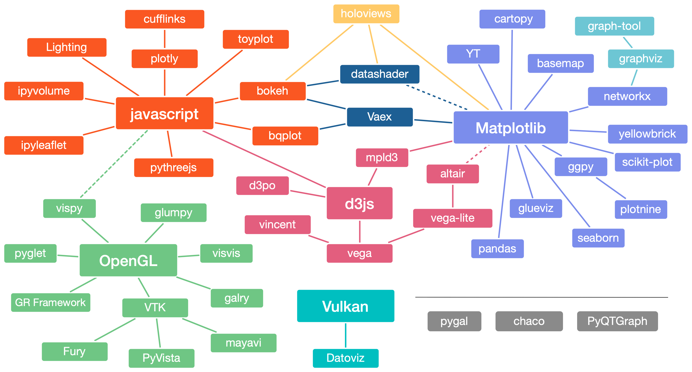
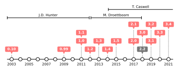

# 前言

​	Python 科学可视化的领域非常广泛。其涉及到形形色色的工具，从最通用、最广泛使用的，到更专业、保密的工具。这些工具一些是由社区开发，而另一些则是由公司开发。有些工具专门用于网络，有些则仅用于桌面，有些处理3D和大数据，而另一些则针对完美的2D渲染。

**图1**
该图是2018年Python在科学可视化领域的概览（部分内容）。该图基于[Jake Vanderplas](http://vanderplas.com/)的原创进行调整。详细资源见: [https://github.com/rougier/python-visualization-landscape](https://github.com/rougier/python-visualization-landscape)

​	面对如此丰富的选择，您可能很难找到最适合需求的软件包，因为您甚至不知道某个软件包的存在。为了帮助您做出选择，您可以先问自己几个问题：

- 您的目标是桌面应用还是Web渲染?
- 您是否拥有复杂的3D渲染场景?
- 您是否对产品有质量要求？
- 您是否需要处理海量数据？
- 这些包的社区是否活跃？
- 这些包有文档和教程吗？

**图2**

Matplotlib最初由John D. Hunter编写，第一个公开版本发布于2003年。在John Hunter于2012年8月去世前不久，Michael Droettboom被提名为Matplotlib的首席开发人员，Thomas Caswell于2014年加入，并担任现任首席开发人员(截至2021年)。最新版本为3.4(撰写本文时) ，其仅支持Python 3，而版本2.2是兼容Python 2和Python 3的长期支持版本。详细资源见[introduction/matplotlib‐timeline.py](https://github.com/rougier/scientific-visualization-book/blob/master/code/introduction/matplotlib-timeline.py).

​	根据读者对上述的回答，您可以决定使用哪个软件包并投入一些时间学习它。例如，如果您需要在浏览器中进行交互式可视化，并与jupyter无缝集成，那么可以选择[bokeh](https://bokeh.pydata.org/)。如果您有非常大的数据并需要在桌面上进行3D可视化，那么[vispy](https://vispy.org/)或[mayavi](https://docs.enthought.com/mayavi/mayavi/)是一个很好的选择。如果您对快速构建漂亮的图形方面非常感兴趣，那么[seaborn](http://seaborn.pydata.org/)和[altair](https://altair-viz.github.io/)是你的得力助手。另外，如果你从事地球科学工作，那么你不能忽视[cartopy](https://scitools.org.uk/cartopy/docs/latest/) 等库。我在此无法列出所有库，我相信在撰写本章和实际出版书籍之间，会诞生出新的可视化库。 [pyviz](https://pyviz.org/) 是一个很好的信息源网站（用于数据可视化的Python工具），该网站收纳了很多可视化库的网站链接，并提供最新的活跃包列表。

**图3**
2019年4月10日，事件视界望远镜发布的第一张图像描绘了超巨椭圆星系M87核心的超大质量黑洞，其质量约为太阳质量的70亿倍。详细资源见[Wikipedia](https://en.wikipedia.org/wiki/Black_hole)

​	在这个领域中，Matplotlib具有非常特殊的地位。它最初是由John D. Hunter于2003年创建的，目的是为了可视化脑皮层电图数据。以下是2003年5月23日发布在Python邮件列表上的[官方公告](https://mail.python.org/pipermail/python-list/2003-April/193167.html)1。

------
1非常感谢 Anthony Lee 给我指出这个公告。

Matplotlib

​	Matplotlib is a pure python plotting package for python and pygtk. My goal is to make high 	quality, publication quality plotting easy in python, with a syntax familiar to matlab users. 	matplotlib is young, and several things need to be done for this goal is achieved. But it works 	well enough to make nice, simple plots.  

Requirements

python 2.2,  GTK2,  pygtk-1.99.x,  and Numeric.

Download

​	See the homepage - nitace.bsd.uchicago.edu:8080/matplotlib

Here are some of the things that matplotlib tries to do well

\*  Allow easy navigation of large data sets. Right click on figure window to bring up navigation tool bar for pan and 		       	zoom of x and y axes. This requires  a wheel mouse. Place the wheel  mouse over the navigation buttons and  scroll 	   	away.
\*  Handle very large data sets efficiently by making use of Numeric clipping. I have used  matplotlib in an EEG plotting 	application with 128 channels and several minutes of data sampled at 400Hz, eg, plotting matrices with dimensions 	120,000 x 128.
\*  Choose tick marks and labels intelligently
\*  make easy things easy (subplots, linestyles, colors)
\*  make hard things possible (OO interface for full control) 

Matplotlib is a class library that can be used to make plots in pygtk applications. But there is a matlab functional compatibility interface that you can get with, eg:: 

​	from matplotlib.matlab import plot, subplot, show, gca

Example scripts and screenshots available at
http://nitace.bsd.uchicago.edu:8080/matplotlib

John Hunter     

​	Matplotlib最初的目标是取代流行的 Matlab 图形引擎，支持不同的平台，具有高质量的光栅和矢量输出，为数学表达式提供支持，并从 Shell 交互式工作。2003 年进行了第一次官方发布（见图 2），15 年后，尽管它们已经得到了进一步的开发和完善，但初心不改。如今，Matplotlib 库已成为 Python 科学可视化的事实标准。例如，它曾被用于显示有史以来第一张黑洞照片（见图 3），此图用于说明引力波的存在。

​	Matplotlib 是一个既多功能又强大的库，可让您设计非常高质量的图形，适用于科学出版。它既提供了一个简单直观的界面（pyplot），也提供了一个面向对象的架构，让程序编写人员可以调整图形中的任何内容。需要注意的是，它也可以用作常规图形库，以设计非科学图形，正如读者们在本书中看到的那样。例如，Matplotlib 时间线图（见图 2）只是由一条带有标记的线和一些带有样式的注释组成。

​	本书分为 4 个部分。第一部分涉及到 Matplotlib 库的基本原理。包括审视构成图形的各个部分，不同的坐标系，可用的比例和投影，我们还将介绍一些排版以及颜色相关的概念。第二部分专门用于介绍图形的实际设计。在介绍完如何生成更好的图形一些简单规则后，作者将详细介绍 Matplotlib 的默认设置和样式系统，然后深入研究图形组织布局。之后，我们将探索各种可用的绘图类型，并了解如何用不同元素装饰图形。第三部分专门讲述更高级的概念，即 3D 图形、优化、动画和工具包。最后，第四部分囊括了展示案例及其分析。
