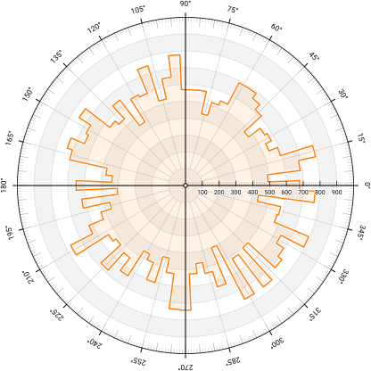
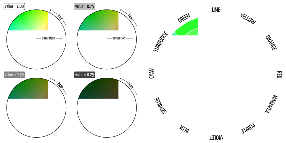

# 基础部分


### 1 图形构成

​	 Matplotlib 图形包含一系列具有层次结构的元素，当它们组合在一起时，就形成了如图 1.1 所示的图形。通常情况下，这些元素并不是用户显式创建的，而是运行各种绘图命令的中间产物。让我们来看一下就目前而言我们能编写的最简单的matplotlib脚本:

```python
plt.plot(range(10))
plt.show()
```

​	为了展示结果，matplotlib 需要创建图 1.1 上显示的大部分元素。具体需要创建多少元素取决于默认设置（参见第 7 章），但matplotlib会最小化创建一个 [Figure](https://matplotlib.org/api/figure_api.html)，它是所有绘图元素的顶层容器，包含了大部分图形元素的 [Axes](https://matplotlib.org/api/axes_api.html)，以及实际所绘的部分。在本例中为一条线。通常不需要指定所有内容，但其实转念一想，这种方式其实限制了编码人员的选择，因为缺省元素会自动使用默认值。例如，在前面的示例中，还无法控制初始图形的大小，因为在创建过程中隐式地选择了图形大小。如果想改变图形的大小或坐标轴的外观，则需要更详细地表达：

```python
fig = plt.figure(figsize=(6,6))
ax = plt.subplot(aspect=1)
ax.plot(range(10))
plt.show()
```

在许多情况下，可以使用[subplot](https://matplotlib.org/api/_as_gen/matplotlib.pyplot.subplots.html)方法紧凑代码。

```python
fig, ax = plt.subplots(figsize=(6,6),subplot_kw={"aspect"=1})
ax.plot(range(10))
```


**图1.1**

Matplotlib 图形由多个层次结构的元素组成，把这些元素组合在一起，就形成了实际的图形（来源：[anatomy/anatomy.py](anatomy/anatomy.py  )  ）。

```python
plt.show()
```

#### 元素

你可能已经注意到之前的例子中，[plot](https://matplotlib.org/api/_as_gen/matplotlib.pyplot.plot.html) 命令是连接到ax而不是plt。实际上使用plt.plot的方法是告诉matplotlib我们想要在当前坐标轴上绘图,也就是最近创建的坐标轴,无论是显示还是隐式的指出。在《Python之禅》(Tim Peters 著)中已经提到了显式优于隐式(import this)。当你有余力时,最好显式地指定你想要做什么。因此,了解图形的不同元素是非常重要的。

[Figure](https://matplotlib.org/api/figure_api.html) ：在图形中最重要的元素就是图形本身。当调用figure方法时创建figure图像，并且可以指定初始大小，背景颜色（facecolor）和一个标题（suptitle）。请注意，当你保存图片时，背景颜色设置并不会生效，因为savefig函数也有一个facecolor参数（默认为白色），它会将你设置的图片背景参数覆盖掉。如果你在保存图片时不想设置任何背景颜色的话，可以指定transparent=True。

[Axes](https://matplotlib.org/api/axes_api.html) ：这是第二重要的元素，对应于实际渲染数据的区域。它也被称为子图。每个图形中有一个到多个坐标轴，每个坐标轴通常有四个边（左，上，右和下），这些边被称为脊线。每条轴都可以用主刻度和次刻度（可以指向内侧或外侧）、刻度线标签和一个标签来装饰。

[Axis](https://matplotlib.org/api/axis_api.html) ：用来装饰脊线的元素被称为轴。水平的是x轴，垂直的是y轴。它们中的每一个都是由天平、主要和次要刻度、主要和次要刻度标签和轴标签组成。

[Spines](https://matplotlib.org/api/spines_api.html) ：脊线是连接轴刻度线的线，并指出数据区域的边界。它们可以被放置在任意位置，并且可以设置其是否可见。

[Artist](https://matplotlib.org/tutorials/intermediate/artists.html) ：图上的一切，包括Figure、Axes和Axis对象，都是一个Artist。这包括文本对象、Line2D对象、集合对象、补丁对象。当图形被渲染时，所有的Artist都会被绘制画在画布上。请注意，一个Artist只能出现在一个Axes中。


#### **图形基元**

无论一个plot是怎样的，它都由补丁、线条和文字组成。补丁可以非常小（如标记）或非常大（如条形），并有一系列形状（圆形、矩形、多边形等）。线条可以是非常小而细的（如刻度线）或非常粗的（如舱口）。文本可以使用你系统中的任何字体，也可以使用Latex引擎来渲染数学公式。


**图 1.2  **

所有的图形基元（即Artist）都可以被访问和修改。在上图中，我们修改了X轴刻度线标签的粗细（源代码：[anatomy/bold‐ ticklabel.py](anatomy/bold‐ ticklabel.py)  ）

这些图形基元中也拥有很多其他属性，比如颜色（图面颜色和图边颜色）、透明度（从0到1）、图案（如破折号）、样式（如cap样式）、特殊效果（如阴影或轮廓）、抗锯齿（True or False）等。大多数时候不会直接去操作这些基元，而会去调用使用这些基元的集合来构建渲染的方法。例如，向一个图形添加一个新的轴时，matplotlib将为线段和刻度线建立一个线段集合，也将为刻度线和轴的标签添加一个标签集合。尽管这些对编码人员来说是完全透明的，但仍然可以在必要时直接访问这些元素。例如，为了使X轴上的刻度线变成粗体，我们可以这样写：

```python
fig, ax = plt.subplots(figsize=(5,2))
for label in ax.get_xaxis().get_ticklabels():
    label.set_fontweight("bold")
plt.show()
```

任何基元都包含一个重要属性 --zorder，它表示基元的虚拟深度，如图1.3 所示。zorder值用于在渲染基元之前将其从低到高进行排序，这样就可以控制渲染的先后顺序。大多数artists都拥有一个默认的zorder值，这样就会被提前渲染出来。而脊线、刻度线和刻度线标签通常在绘图之后渲染。


**图 1.3  **

不同元素和图形基元的默认渲染顺序。渲染顺序是由下往上。请注意，一些方法将覆盖这些默认值来修正位置（源代码：[anatomy/zorder.py](https://github.com/rougier/scientific-visualization-book/blob/master/code/anatomy/zorder.py) ）。


#### 后端

后端是负责图形绘制的渲染器和图形交互用户界面的组合。目前为止，我们一直在使用默认的渲染器和界面，在调用plt.show()方法时显示一个窗口。输入以下代码来查询默认后端：

```python
import matplotlib
print(matplotlib.get_backend())
```

在作者例子中，默认的后端是MacOSX，但读者后端可能不同。如果读者想切换为另一个后端，可以输入：

```python
import matplotlib
matplotlib.use("xxx")
```

如果读者用下面表1.1中的渲染器替换xxx，最终会得到一个非交互式的图形，即一个不能在屏幕上显示而只能保存在磁盘上的图形。

**表 1.1**

可用的matplotlib渲染器

| 渲染器 | 类型            | 文件类型                       |
| ------ | --------------- | ------------------------------ |
| Agg    | raster          | Portable Network Graphic (PNG) |
| PS     | vector          | Postscript (PS)                |
| PDF    | vector          | Portable Document Format (PDF) |
| SVG    | vector          | Scalable Vector Graphics (SVG) |
| Cairo  | raster / vector | PNG / PDF / SVG                |

**表1.2**

可用的matplotlib接口

| 接口   | 渲染器       | 依赖项                                                       |
| ------ | ------------ | ------------------------------------------------------------ |
| GTK3   | Agg or Cairo | [PyGObject](https://pygobject.readthedocs.io/en/latest/) & [Pycairo](https://pycairo.readthedocs.io/en/latest/) |
| Qt4    | Agg          | [PyQt4](https://www.riverbankcomputing.com/software/pyqt/intro) |
| Qt5    | Agg          | [PyQt5](https://www.riverbankcomputing.com/software/pyqt/intro) |
| Tk     | Agg          | [TkInter](https://wiki.python.org/moin/TkInter)              |
| Wx     | Agg          | [wxPython](https://www.wxpython.org/)                        |
| MacOSX | —            | OSX (obviously)                                              |
| Web    | Agg          | Browser                                                      |

典型的渲染器是Agg，它使用[Anti-Grain](https://antigrain.com)与[Geometry C++](https://antigrain.com)库来制作图形的光栅图像（见图1.4，了解光栅和矢量之间的区别）。请注意，即使选择了光栅渲染器，仍然可以用矢量格式保存图形，反之亦可。


图1.4

栅格图形和矢量图形的缩放效果（源地址[anatomy/raster‐vector.py](anatomy/raster‐vector.py)）。

如果读者想与图形之间有一些互动，则必须将可用的接口（见表1.2）与渲染器结合起来。例如**GTK3Cairo**或**WebAgg**。

例如，要在浏览器中进行渲染，读者可以这样写代码：

```python
import matplotlib
matplotlib.use('webagg')
import matplotlib.pyplot as plt
plt.show()
```

`警告: 必须在导入pyplot之前调用use函数。`

一旦指定了交互式的后端，就可以在交互式模式下产生一个图形（图形会在每个matplotlib命令之后被更新）：

```python
plt.ion() #交互模式打开
plt.plot([1,2,3]) #图示
plt.xlabel("X Axis") #更新标签
plt.ioff() #交互模式关闭
```

如果读者想了解更多关于后端的信息，可以去看一下matplotlib网站上的[介绍导论 ](https://matplotlib.org/tutorials/introductory/usage.html#backends)https://matplotlib.org/tutorials/introductory/usage.html#backends教程。

在OSX和[iterm2](https://iterm2.com/)终端下的一个有趣的后端是imgcat，它允许在终端内直接渲染一个图形，模拟jupyter笔记本效果，如图1.5所示。


图1.5

Matplotlib imgcat 后端（源码：sources: [anatomy/imgcat.py](anatomy/imgcat.py)  ）

```python
import numpy as np
import matplotlib
matplotlib.use("module://imgcat")
import matplotlib.pyplot as plt
fig = plt.figure(figsize=(8,4), frameon=False)
ax = plt.subplot(2,1,1)
X = np.linspace(0, 4*2*np.pi, 500)
line, = ax.plot(X, np.cos(X))
ax = plt.subplot(2,1,2)
X = np.linspace(0, 4*2*np.pi, 500)
line, = ax.plot(X, np.sin(X))
plt.tight_layout()
plt.show()
```

对于其他类型的终端，需要使用[sixel](https://github.com/koppa/matplotlib-sixel)后端，它可能在xterm平台下能够运行（未测试）。


#### 图形以及分辨率

在本章的第一个例子中，我们指定了一个(6,6)的图形尺寸，相当于6英寸（宽）× 6英寸（高）的尺寸，默认的dpi（每英寸点数）为100。在屏幕上显示时，点数就对应于像素的个数，也即每英寸100像素点数，我们可以立即推断出图的大小（即不含工具栏的窗口大小），其正好为600×600像素。如果使用png(便携式网络图形)等位图格式得到的结果也如此：

```python
fig = plt.figure(figsize=(6,6))
plt.savefig("output.png")
```

如果我们使用ImageMagick图形套装中的识别命令来查询生成的图像，可以得到如下显示：

```shell
$ identify output.png
Image: output.png
    Format: PNG (Portable Network Graphics)
    Mime type: image/png
    Class: DirectClass
    Geometry: 600x600+0+0
    Resolution: 39.37x39.37
    Print size: 15.24x15.24
    Units: PixelsPerCentimeter
    Colorspace: sRGB
    ...
```


根据输出结果来看，这证实了图像的几何尺寸大小是600×600，而分辨率是 39.37 ppc（每厘米像素），对应于39.37*2.54 ≈ 100 dpi（每英寸点数）。如果要把这个图片放在一个文件里 同时保持相同的dpi，则需要将图像的大小设置为 15.24厘米×15.24厘米。如果在文件中缩小图像、 比方说，缩放3倍，在这种特定的情况下，它仅会机械地增加数字dpi到 300。对于一篇科学文章，出版商通常会要求图片的dpi在300-400之间。要求数字dpi在300-600之间。为了图片能够被清晰展示，在将图片插入到文档之前，最好清楚数字在插入文档后的物理尺寸是多少。


图1.6

在matplotlib中使用不同的dpi（50、100、300和600）渲染出的文本  (源代码：[Anatomy/figure-dpi.py](Anatomy/figure-dpi.py) ）

举一个更具体的例子，我们想象有一本书，这本书的版面格式大小为A5（148×210毫米）。左右页边距各为20毫米，图像通常以全文宽度显示。这意味着图片的物理宽度正好是108毫米，大约为4.25英寸。如果我们使用推荐的600dpi，会得到2550像素的宽度，这可能会超出屏幕分辨率，因此这种方式很不方便。Matplotlib 给出了解决方案，当我们在屏幕上显示图形时，可以使用默认的matplotlib dpi（100），只有保存图形时，才会使用不同的、更高的dpi：

```python
def figure(dpi):
    fig = plt.figure(figsize=(4.25,.2))
    ax = plt.subplot(1,1,1)
    text = "Text rendered at 10pt using %d dpi" % dpi
    ax.text(0.5, 0.5, text, ha="center", va="center",
            fontname="Source Serif Pro",
            fontsize=10, fontweight="light")
    plt.savefig("figure-dpi-%03d.png" % dpi, dpi=dpi)
figure(50), figure(100), figure(300), figure(600)
```

图1.6显示了不同dpi设置下的输出结果。只有dpi为600时输出的结果才是最清晰的。请注意,最好将结果保存为PDF格式(便携文档格式),因为它是向量格式,可以完美地适应任何分辨率。然而,即使将图像保存为向量格式,对于无法向量化的图像元素上仍需要指明dpi(每英寸点数)。读者可能已经注意到,图1.6中的字体大小看起来与现在正在阅读的文字字体大小相同。这并非巧合, 因为这个LaTex文档使用了10点大小字体,matplotlib中的图像也使用了10点大小字体。但是衡量大小的单位 - “点”究竟是什么? 在Latex中,1点(pt)相当于1/72.27英寸,而在matplotlib中,1点相当于1/72英寸。为了帮助读者直观地了解图像的真实尺寸, 笔者在图像上添加标尺以显示当前图像尺寸,如图1.7所示。如果手动调整图像大小,就会发现图像的实际尺寸发生了变化,而如果仅仅改变dpi的话，图像的大小不会改变。使用起来非常简单，如下:

```python
import ruler
import numpy as np
import matplotlb.pyplot as plt
fig,ax = plt.subplots()
ruler = ruler.Ruler(fig)
plt.show()
```

#### 练习

练习的时候到了,尝试做一些简单的练习,把目前为止所学到的概念整合运用起来(允许查找相关文档)。

**练习1**:尝试生成一个指定(精确的)像素大小的图像(例如512 x 512像素)。如何指定图像大小并保存图像?

**练习2**:生成如图1.9所示图片, 显示双坐标轴,单位分别为英寸与厘米。难点是在打印时,英寸与厘米单位在真实世界上是正确的。这需要一些简单的计算来找到正确的大小,以及需要尝试多次来生成实际的图像。不需要沉浸于细节之中,主要的是得到正确的大小。


图1.7

交互式标尺(源代码：[anatomy/ruler.py](https://github.com/rougier/scientific-visualization-book/blob/master/code/anatomy/ruler.py))


图1.8

使用精确图像大小的像素字体文本  （源代码：[anatomy/pixel‐font.py](https://github.com/rougier/scientific-visualization-book/blob/master/code/anatomy/pixel-font.py)）


图1.9

英寸/厘米换算 (源代码: [anatomy/inch‐cm.py](https://github.com/rougier/scientific-visualization-book/blob/master/code/anatomy/inch-cm.py)).  

**练习3**

请尝试去复现图1.10。如果读者仔细观察这张图的话,会发现每条曲线都部分遮挡着其它曲线,因此正确设置zorder非常重要, 这样其渲染结果就不会依赖于绘制顺序。可以从以下代码入手:

```python
def curve():
    n = np.random.randint(1,5)
    centers = np.random.normal(0.0,1.0,n)
    widths = np.random.uniform(5.0,50.0,n)
    widths = 10*widths/widths.sum()
    scales = np.random.uniform(0.1,1.0,n)
    scales /= scales.sum()
    X = np.zeros(500)
    x = np.linspace(-3,3,len(X))
    for center, width, scale in zip(centers, widths, scales):
    	X = X + scale*np.exp(- (x-center)*(x-center)*width)
    return X
```


图 1.10

多个plots之间部分相互覆盖（源代码：[anatomy/zorder‐plots.py](anatomy/zorder‐plots.py)）


### 2 坐标系

在任何matplotlib图像中, 至少存在着两种不同的坐标系。一种与整个图像相关(图坐标系,FC)，其他的与每个独立绘图区域相关(数据坐标系，DC)。如图2.1和图2.2所示，这些坐标系统都有归一化版本(NxC)和原生版本(xC)。为了实现坐标在不同坐标系统之间转换，matplotlib提供了一组变换函数:

```Python
fig = plt.figure(figsize=(6, 5), dpi=100)
ax = fig.add_subplot(1, 1, 1)
ax.set_xlim(0,360), ax.set_ylim(-1,1)
# FC : Figure coordinates (pixels)
# NFC : Normalized figure coordinates (0 → 1)
# DC : Data coordinates (data units)
# NDC : Normalized data coordinates (0 → 1)
DC_to_FC = ax.transData.transform
FC_to_DC = ax.transData.inverted().transform
NDC_to_FC = ax.transAxes.transform
FC_to_NDC = ax.transAxes.inverted().transform
NFC_to_FC = fig.transFigure.transform
FC_to_NFC = fig.transFigure.inverted().transform
Let’s test theses functions on some specific points (corners):
# Top right corner in normalized figure coordinates
print(NFC_to_FC([1,1])) # (600,500)
# Top right corner in normalized data coordinates
print(NDC_to_FC([1,1])) # (540,440)
```


**图2.1**

使用笛卡尔投影的坐标系统。**FC**:图坐标系，**NFC**:归一化图坐标系，**DC**:数据坐标系，**NDC**:归一化数据坐标系 

```python
# Top right corner in data coordinates
print(DC_to_FC([360,1])) # (540,440)
```

由于提供了反向转换函数，所以可以进行自定义坐标转换。例如,从原生数据坐标系(DC)到归一化数据坐标系(NDC):

```python
# Native data to normalized data coordinates
DC_to_NDC = lambda x: FC_to_NDC(DC_to_FC(x))
```


**图2.2**

使用极坐标投影的坐标系统。**FC**:图坐标系，**NFC**:归一化图坐标系，**DC**:数据坐标系，**NDC**:归一化数据坐标系


```python
# Bottom left corner in data coordinates
print(DC_to_NDC([0, -1])) # (0.0, 0.0)
# Center in data coordinates
print(DC_to_NDC([180,0])) # (0.5, 0.5)
# Top right corner in data coordinates
print(DC_to_NDC([360,1])) # (1.0, 1.0)
```


当使用笛卡尔投影时,归一化坐标系和原生坐标系之间的对应关系是非常清晰的。对于其他方式的投影,尽管看起来不那么明显，但原理是一样的。例如,考虑使用极坐标投影时,需要绘制外部的坐标轴边框。在归一化数据坐标系中，四个角的坐标分别是(0,0)、(1,0)、(1,1)和(0,1)。然后可以把这些归一化坐标数据转换回原生数据坐标，并绘制边框。但是还有一个额外的难点，就是这些坐标点超出了坐标轴的限制，需要显示指定matplotlib忽略限制，可以通过设置clip_on参数来实现。

```python
fig = plt.figure(figsize=(5, 5), dpi=100)
ax = fig.add_subplot(1, 1, 1, projection='polar')
FC_to_DC = ax.transData.inverted().transform
NDC_to_FC = ax.transAxes.transform
NDC_to_DC = lambda x: FC_to_DC(NDC_to_FC(x))
P = NDC_to_DC([[0,0], [1,0], [1,1], [0,1], [0,0]])
plt.plot(P[:,0], P[:,1], clip_on=False, zorder=-10
color="k", linewidth=1.0, linestyle="--", )
plt.scatter(P[:-1,0], P[:-1,1],
clip_on=False, facecolor="w", edgecolor="k")
plt.show()
```


结果如图2.3所示

然而，大多数时候，你不需要显式地使用这些变换函数,而是隐式地使用它们。例如,考虑这样一种情况,你想在特定的绘图上添加一些文本。为此,你需要使用[text](https://matplotlib.org/api/_as_gen/matplotlib.pyplot.text.html)函数,并指定要写入的内容(当然)以及要显示文本的坐标。问题是(对于matplotlib来说)，这些坐标应该如何理解？它们的表示方式是否是数据坐标？还是归一化的数据坐标？亦或是归一化的图坐标？默认情况下，matplotlib会假定它们以数据坐标表达。因此，如果要使用不同的坐标系统，在调用函数时就需要明确指定一个变换。比如，我们要在右下角添加一个字母。可以这样写:

```python
fig = plt.figure(figsize=(6, 5), dpi=100)
ax = fig.add_subplot(1, 1, 1)
ax.text(0.1, 0.1, "A", transform=ax.transAxes)
```


图2.3

在极坐标投影中，使用从标准化数据坐标到数据坐标的转换来定义轴边界([coordinates/transform‐polar.py](https://github.com/rougier/scientific-visualization-book/blob/master/code/coordinates/transform-polar.py) ).  


```python
plt.show()
```


把字母放置在距左侧书脊 10%、距右侧书脊 10%的位置。如果两条脊柱的物理尺寸（像素）相同，字母与右侧和底部脊柱的距离将相等。但是，如果它们的大小不同，就不再是这样了，结果也不会令人满意（见图 2.4 的 A 部分）。我们要做的是指定一个变换，这个变换是归一化数据的坐标（0,0）加上一个以图形原生单位（像素）表示的偏移量的组合。为此，需要建立自定义的变换函数来计算偏移量：


```python
from matplotlib.transforms import ScaleTranslation
fig = plt.figure(figsize=(6, 4))
ax = fig.add_subplot(2, 1, 1)
plt.text(0.1, 0.1, "A", transform=ax.transAxes)
ax = fig.add_subplot(2, 1, 2)
dx, dy = 10/fig.dpi, 10/fig.dpi
offset = ScaledTranslation(dx, dy, fig.dpi_scale_trans)
plt.text(0, 0, "B", transform=ax.transAxes + offset)
plt.show()
```


结果如图 2.4 的 B 面板所示。现在，文字的位置已经正确，并且不受图宽比或数据限制的影响。


图2.4


使用 transforms  在绘图上精确定位文本。顶部面板使用归一化数据坐标（0.1,0.1），底部面板使用归一化数据坐标（0.0,0.0）加上以图形坐标表示的偏移（10,10）([coordinates/transform-letter.py](https://github.com/rougier/scientific-visualization-book/blob/master/code/coordinates/transform-letter.py) )。

如果需要在 X 轴和 Y 轴上进行不同的变换，情况就会变得更复杂。例如，我们可以考虑在 X 刻度标签下方添加一些文本。刻度标签的 X 位置用数据坐标表示，但如何像图 2.5 那样在下面添加文字呢？


图2.5

使用从归一化数据坐标到数据坐标的转换（coordinates/transform-blend.py），在极投影中确定轴边界。
文本的自然单位是点，因此我们希望使用以点表示的 Y 偏移量来定位箭头。为此，需要使用混合变换：

```python
point = 1/72
fontsize = 12
dx, dy = 0, -1.5*fontsize*point
offset = ScaledTranslation(dx, dy, fig.dpi_scale_trans)
transform = blended_transform_factory(
ax.transData, ax.transAxes+offset)
```


我们还可以将变换用于完全不同的用途，如图 2.6 所示。为了得到这样的图，作者重写了 imshow 函数，以应用平移、缩放和旋转，并以随机值调用该函数 200 次。

```python
def imshow(ax, I, position=(0,0), scale=1, angle=0):
height, width = I.shape
extent = scale * np.array([-width/2, width/2,
-height/2, height/2])
im = ax.imshow(I, extent=extent, zorder=zorder)
t = transforms.Affine2D().rotate_deg(angle).translate(*
position)
im.set_transform(t + ax.transData)
```


图2.6  

Collage (源: [coordinates/collage.py](https://github.com/rougier/scientific-visualization-book/blob/master/code/coordinates/collage.py) ).  

Transform是非常强大的工具，尽管读者在日常生活中不会经常用到它。但在某些情况下，您会很高兴了解它们。您可以通过 matplotlib 网站上的[Transform教程](https://matplotlib.org/tutorials/advanced/transforms_tutorial.html)进一步了解Transform和坐标。


**实际使用案例**

现在我们来研究图 2.7 所示的一个实际变换案例。这是一个简单的散点图，显示了一些高斯数据，有两个主轴并且添加了一个与第一主轴正交的直方图，以显示主轴上的分布情况。这张图看似简单（一个散点图和一个正交直方图），但实际情况却大相径庭，渲染这样一张图的难度可想而知。主要的困难在于如何使直方图有正确的位置、大小和方位，因为位置必须以数据坐标设置，大小必须以图形归一化坐标给出，而方位则以度为单位。更为复杂的是，我们希望用数据点来表示文字在直方图柱形图上方的高度。

您可以查看资料以了解完整的故事，但让我们集中讨论主要的困难，即添加旋转浮动轴。让我们从一个简单的图形开始：

```python
import numpy as np
import matplotlib.pyplot as plt
from matplotlib.transforms import Affine2D
import mpl_toolkits.axisartist.floating_axes as floating
fig = plt.figure(figsize=(8,8))
ax1 = plt.subplot(1,1,1, aspect=1,xlim=[0,10], ylim=[0,10])
```


假设我们想要一个浮动刻度的数轴，其数据坐标中心为 (5,5)，数据坐标大小为 (5,3)，方向为 -30 度：

```python
center = np.array([5,5])
size = np.array([5,3])
orientation = -30
T = size/2*[(-1,-1), (+1,-1), (+1,+1), (-1,+1)]
rotation = Affine2D().rotate_deg(orientation)
P = center + rotation.transform(T)
```


在上面的代码中，我们定义了划定新坐标轴范围的四个点，并利用 matplotlib 仿射变换进行了旋转。此时，已经有了以数据坐标描述轴边界的点，由于浮动数轴需要，将其转换为归一化图形坐标。


图2.7   与 PCA 第二主轴对齐的旋转直方图（[coordinates/transforms‐ hist.py](https://github.com/rougier/scientific-visualization-book/blob/master/code/coordinates/transforms-hist.py)   ）


```python
DC_to_FC = ax1.transData.transform
FC_to_NFC = fig.transFigure.inverted().transform
DC_to_NFC = lambda x: FC_to_NFC(DC_to_FC(x))
```


由于浮动数轴的位置需要用非旋转边界框来定义，因此还存在一个难题，如何拿到边界坐标？：


```python
xmin, ymin = DC_to_NFC((P[:,0].min(), P[:,1].min()))
xmax, ymax = DC_to_NFC((P[:,0].max(), P[:,1].max()))
```


现在我们已经拿到了添加新轴的所有信息：

```python
transform = Affine2D().rotate_deg(orientation)
helper = floating.GridHelperCurveLinear(
transform, (0, size[0], 0, size[1]))
ax2 = floating.FloatingSubplot(
fig, 111, grid_helper=helper, zorder=0)
ax2.set_position((xmin, ymin, xmax-xmin, ymax-xmin))
fig.add_subplot(ax2)
```

结果如图2.9所示


**练习**

练习1  当指定散点图中标记的尺寸时，该尺寸以点为单位。请尝试绘制以数据点表示大小的散点图，如图 2.8 所示。


图2.8  使用数据坐标表示大小而不是点表示的散点图(coordinates/transforms‐exercise‐1.py ).  


图2.9  可控制位置尺寸及旋转的单浮动和旋转浮动数轴 ([coordinates/transforms‐floating‐axis.py](https://github.com/rougier/scientific-visualization-book/blob/master/code/coordinates/transforms-floating-axis.py) )  


### 比例尺与投影


除了仿射变换，matplotlib 还提供更高级变换，可以在不修改数据的情况下大幅改变数据的表现形式。这些变换相当于一个数据预处理阶段，允许根据数据的性质来调整渲染效果。正如 matplotlib 文档中解释的那样，有两个主要的变换系列：在单一维度上工作的可分离变换称为 "比例尺"（Scale），同时在两个或多个维度上处理数据的不可分离变换称为 "投影"（Projections）。


#### 比例尺


比例尺提供了数据与图表中数据在给定维度上的代表之间的映射机制。Matplotlib 提供了四种不同的标度（linear, log,  symlog 和 logit），并对每种标度都进行了修改，如调整刻度线的位置和标签（见图 3.1）。请注意，比例尺可以只应用于 x 轴（set_xscale）、y 轴（set_yscale）或两者。
默认（也是隐含的）比例尺是线性的，因此一般不需要指定任何比例尺。您可以通过比较图形坐标中三个点之间的距离（实际上我们应该比较每一个点，但您应该明白这一点）来检查缩放比例是否是线性的，并检查它们在数据空间中的差值是否与在图形空间中的差值相同，并使用给定系数模运算（请参阅 [scales-projections/scales-check.py](https://github.com/rougier/scientific-visualization-book/blob/master/code/scales-projections/scales-check.py) ）。

```shell
>>> fig = plt.figure(figsize=(6,6))
>>> ax = plt.subplot(1, 1, 1,
aspect=1, xlim=[0,100], ylim=[0,100])
>>> P0, P1, P2, P3 = (0.1, 0.1), (1,1), (10,10), (100,100)
>>> transform = ax.transData.transform
```


图3.1

[linear](https://matplotlib.org/api/scale_api.html?#matplotlib.scale.LinearScale) , [log](https://matplotlib.org/api/scale_api.html?#matplotlib.scale.LogScale) 以及 [logit](https://matplotlib.org/api/scale_api.html?#matplotlib.scale.LogitScale) 比例尺的对比。(来源：[scales-projections/scales-comparison.py](https://github.com/rougier/scientific-visualization-book/blob/master/code/scales-projections/scales-comparison.py) ）。


```shell
>>> print((transform(P1)-transform(P0))[0])
4.185
>>> print((transform(P2)-transform(P1))[0])
41.85
>>> print((transform(P1)-transform(P0))[0])
418.5
```


对数比例尺（[log](https://matplotlib.org/api/scale_api.html?#matplotlib.scale.LogScale)）是一种非线性比例尺，它不是等步长递增，而是每个区间以对数底数的系数递增（因此得名）。对数比例尺用于严格意义上的正值，因为负值和空值的对数是未定义的。如果我们应用之前的脚本来检查数据和图空间的差异，现在可以看到距离是相同的：

```shell
>>> fig = plt.figure(figsize=(6,6))
>>> ax = plt.subplot(1, 1, 1,
aspect=1, xlim=[0.1,100], ylim=[0.1,100])
>>> ax.set_xscale("log")
>>> P0, P1, P2, P3 = (0.1, 0.1), (1,1), (10,10), (100,100)
>>> transform = ax.transData.transform
>>> print( (transform(P1)-transform(P0))[0] )
155.0
>>> print( (transform(P2)-transform(P1))[0] )
155.0
>>> print( (transform(P1)-transform(P0))[0] )
155.0
```


如果数据为负值，则必须使用对称对数刻度（[symlog](https://matplotlib.org/api/scale_api.html?#matplotlib.scale.SymmetricalLogScale)），它由线性刻度和对数刻度组成。更确切地说，0 附近的数值使用线性刻度，0 附近以外的数值使用对数刻度。当然，也可以在设置刻度时指定线性区域的范围。logit 刻度用于范围为[0,1]的数值，在 "边界 "使用对数刻度，在中间（0.5 左右）使用准线性刻度。如果这些刻度都不能满足需求，还可以选择自定义刻度：

```python
def forward(x):
	return x**(1/2)
def inverse(x):
	return x**2
ax.set_xscale('function', functions=(forward, inverse))

```

在这种情况下，必须提供可以转换数据的正和反函数。当在鼠标指针下显示坐标时，就会用到反函数。


图3.2      自定义（用户定义）刻度。(来源：[scales-projections/scales-custom.py](https://github.com/rougier/scientific-visualization-book/blob/master/code/scales-projections/scales-custom.py)）。

最后，如果需要自定义带有复杂变换的比例尺，则需要编写一个合适的比例尺对象，这在 [matplotlibdocumentation](https://matplotlib.org/gallery/scales/custom_scale.html) 中有详细说明。


#### 投影


投影比缩放要复杂一些，但同时也强大得多。通过投影，您可以在将数据渲染成图形之前对其进行任意变换。只要你知道如何将数据转换为二维（数字空间）和对等的数据，那么你可以应用无限的变换类型。换句话说，您需要定义一个正变换和一个反变换。Matplotlib 只提供了几种标准投影，但却提供了创建新的与特定领域相关的投影（例如制图投影）的所有工具。你可能想知道为什么自带的投影这么少。答案是，对于开发人员来说，实现和维护每一个特定领域的投影太耗时、太困难。因此，他们选择实现比较局限但是最通用的投影，即[极坐标投影](https://matplotlib.org/api/projections_api.html#module-matplotlib.projections.polar)和 [3D](https://matplotlib.org/mpl_toolkits/mplot3d/tutorial.html) 投影。

在上一章中，已经了解了极坐标投影。最简单直接的方法是在创建轴时指定投影：

```python
ax = plt.subplot(1, 1, 1, projection='polar')
```


该轴现在配备了极坐标投影。这意味着应用的任何绘图命令都会经过预处理，以便对数据自动应用正向变换。在极坐标投影的情况下，前向变换必须指定如何从极坐标 (ρ, θ) 转换为笛卡尔坐标 (x, y) = (ρcos(θ), ρsin(θ))。在声明极坐标时，可以指定坐标轴的极限，正如之前所做的那样，但也有一些专门的设置，如 set_thetamin、set_thetamax、set_rmin、set_rmax，以及更具体的 set_rorigin。如图 3.3 所示，这样就可以对实际显示的内容进行精细控制。


图3.3    极坐标投影（来源：scales-projections/projection-polar-config.py）


​	如果尝试去绘制一些曲线图（如曲线图、散点图、柱状图），你会发现除了少数元素外，所有元素都被转换了。更确切地说，标记的形状没有变换（圆盘标记在视觉上仍然是圆盘），文本没有变换（保持可读性），线条的宽度保持不变。让我们来看一张更详细的图，以更准确地理解它的含义。在图 3.4 中，我主要使用  [fill_between](https://matplotlib.org/api/_as_gen/matplotlib.axes.Axes.fill_between.html) 命令绘制了一个简单的标识。使用fill_between 命令在两个不同的 ρ 值之间绘制了灰色/白色同心圆，而直方图则是用不同的 ρ 值绘制的。如果现在仔细观察刻度范围从 100 到 900 的 ρ 轴，就会发现刻度的垂直大小相同。这确实是我出于纯粹的美学考虑而故意引入的异常现象。如果我使用绘图命令来指定刻度线，每个刻度线的长度将与角度差（垂直尺寸）相对应，并且距离中心越远，刻度线会变得越来越高。为了得到规则的刻度线，我们必须使用逆变换进行一些计算（请记住，投影就是正变换和逆变换）。我不会在这里给出所有细节，但你可以阅读代码（[projection-polar-histogram.py](https://github.com/rougier/scientific-visualization-book/blob/master/code/projection-polar-histogram.py)）来了解它是如何生成的。请注意，逆变换所扮演的角色是将鼠标坐标系（笛卡尔二维坐标）连接回数据。

​	相反，在某些情况下，我们可能希望对文本和标记进行转换，如图 3.5 所示。

​	在这个示例中，标记和文本都是手动转换的。对于标记来说，有一个技巧是使用[椭圆](https://matplotlib.org/stable/api/_as_gen/matplotlib.patches.Ellipse.html)将其近似为一系列小线段，每个线段都经过转换（译者注：微分的思想）。在相应的代码中，只需指定伪标记的中心和大小，预处理阶段就会对组成标记（椭圆）的各个部分进行极坐标系投影，从而得到一个略微弯曲的椭圆。对于文本来说，处理过程是一样的，但要复杂一些，因为首先需要将文本转换成可转换路径（这将会在下一章节中详细介绍）。





**图3.4**

使用默认设置的极坐标投影（来源：[scales‐projections/projection‐ polar‐histogram.py](https://github.com/rougier/scientific-visualization-book/blob/master/code/scales-projections/projection-polar-histogram.py) ）

​	Matplotlib 提供的第二种投影是3D投影，即从3D笛卡尔空间到2D笛卡尔空间的投影。要使用 3D 投影，一般会使用随 matplotlib 一起提供的 Axis3D 工具包：

```python
from mpl_toolkits.mplot3d import Axes3D
ax = plt.subplot(1, 1, 1, projection='3d')
```

​	有了这个三维坐标轴，您就可以使用常规的绘图命令，但有一个很大的不同：现在需要提供三个坐标（x,y,z），以前只需要提供两个坐标（x,y），如图 3.6 所示。


图3.5

极坐标投影，并对文字和标记进行转换（来源[scales‐projections/text‐polar.py](https://github.com/rougier/scientific-visualization-book/blob/master/code/scales-projections/text-polar.py)）

请注意，此图可能与matplotlib 默认画出的3D 轴不同。因为，作者调整了几乎所有的配置来改进默认外观，并展示如何进行更改。请查看相应的代码，并尝试去修改某些设置并观察实际效果。详情请参考 matplotlib 网站上的 [3D Axis API](https://matplotlib.org/mpl_toolkits/mplot3d/api.html) 文档。在此就不逐一解释了。

注：在缺乏适当的“深度缓冲区”时（译者注：内存限制），三维轴投影的完整性将受到限制。这不是一个bug（也不是一个功能），这会导致图形的元素之间出现渲染故障。


图3.6

三维投影（来源：[scales‐projections/projection‐3d‐frame.py](https://github.com/rougier/scientific-visualization-book/blob/master/code/scales-projections/projection-3d-frame.py) ）

对于其他类型的投影，则需要安装第三方软件包，具体取决于读者打算使用的投影类型，以下是一些介绍：

[Cartopy](https://scitools.org.uk/cartopy/docs/latest/) 是一个 Python 软件包，设计用于地理空间数据处理，以生成地图和进行其他地理空间数据分析。Cartopy 利用功能强大的 PROJ.4、NumPy 和 Shapely 库，提供一个建立在 Matplotlib 基础上的编程接口，可以创建出具有出版质量的地图。

[GeoPandas](https://geopandas.org/) 是一个开源项目，旨在让使用 python 处理地理空间数据变得更容易。GeoPandas 扩展了 pan-das 使用的数据类型，允许对几何类型进行空间操作。几何操作由 Shapely 执行。Geopandas 还依赖 fionaf 进行文件访问，依赖 descartes 和 matplotlib 进行绘图。

[Python-ternary](https://github.com/marcharper/python-ternary) 是一个与 matplotlib 配合使用的绘图库，用于绘制投影到二维平面上的二维单轴三元图。该库提供了用于绘制投影线、曲线（轨迹）、散点图和热图的函数。下面有多个示例和一个简短的教程。

[pySmithPlot](https://github.com/vMeijin/pySmithPlot) 是 matplotlib 的一个扩展，提供了一个投影类，用于用 Python 创建高质量的史密斯图表。生成的图表与 matplotlib 的风格完美融合，并支持几乎所有的自定义选项。

[Matplotlib-3D](https://github.com/rougier/matplotlib-3d) 是一个实验性项目，旨在为 Matplotlib 提供更好、更多功能的 3D 轴。

如果读者对现有投影仍不满意，终极解决方案是自定义投影，这是相当高级的操作，matplotlib 的文档中提供了一些[示例](https://matplotlib.org/devel/add_new_projection.html)。


**练习**

**练习1**   考虑函数 $f(x) = 10x$、$f(x) = x$和 $f(x) = log_{10}(x)$，尝试复现图 3.7。

**练习2 **  目标是绘制一幅显示麦克风极性（全向、亚心形、心形、超心形、双向和枪形）的图。前五种模式是简单的函数，半径随角度变化，而最后一种模式可能需要多做一些功课。


图3.7  

结合线性和对数刻度（来源：[sources: scales‐projections/scales‐log‐ log.py](https://github.com/rougier/scientific-visualization-book/blob/master/code/scales-projections/scales-log-log.py) ）


图3.8  

麦克风极性图（来源：[scales‐projections/polar‐patterns.py](https://github.com/rougier/scientific-visualization-book/blob/master/code/scales-projections/polar-patterns.py)  ）


### 字体元素


​	字体排印学是一门排列字体的艺术，使书面语言在显示时具有可读性和吸引力（[维基百科](https://www.wikiwand.com/en/Typography)）。然而，对于新手来说，文字设计主要是指在屏幕上显示并列的字符，而对于专家来说，文字设计则是指字体、脚本、统一码、字形、升格、降格、跟踪、提示、字间距、形状、重量、倾斜度等。实际上，文字设计远不止是字形的渲染，还涉及许多不同的概念。如果字形渲染是渲染流水线的重要组成部分，那么对排版有一个基本的了解是非常重要的。遗憾的是，我无法在此撰写完整的排版课程，建议感兴趣的读者阅读马修-巴特里克（Matthew Butterick）的《[实用排版](https://practicaltypography.com/)》（Practical Typography）一书。这是一本开放获取的书籍，介绍了主要概念，并给出了改进书面文件的合理建议。

​	在排版这一点上，读者可能持有反对意见，一个科学数字只有几个地方有文字，因此并不那么重要。让我们来看看图 4.1，它只是在排版上有所不同。上半部分是 Matplotlib 在字体家族、倾斜度、重量和大小方面的默认排版选择。这些默认值实际上已经相当不错，但还可以稍作改进，如下图所示，该图使用了不同的字体系列（Roboto Condensed 和 RobotoSlab）、大小和权重。这种差别看似微妙，但确实是科学数字的一个重要维度。


图4.1 排版对人物观感的影响（来源：[typography/typography‐matters.py](typography/typography‐matters.py )  ）

​	遗憾的是，并没有神奇的秘方可以告诉读者如何调整特定图形的排版，这取决于很多因素，而在大多数时候都无法真正控制这些因素。举例来说，如果制作的图表要在科学杂志上发表，那么就需要在文章中加入该图表。这类期刊有一个模板，规定了文章将来的排版（如果被录用的话）以及字体堆栈，即正文、参考书目和外围信息的字体选择。如果希望自己的文章有一个好的外观，就需要相应地选择字体。为此，可以查看系统中安装的字体，或浏览在线图库，如 [Font squirrel](https://www.fontsquirrel.com/)、[dafont.com](https://www.dafont.com/fr/) 或 [Google font](https://fonts.google.com/)。

如果在系统中安装了新字体，请不要忘记重建字体列表缓存，否则 Matplotlib 会忽略新安装的字体：

```python
import matplotlib.font_manager
matplotlib.font_manager._rebuild()
```


#### 字体堆叠

​	Matplotlib 字体堆栈使用四种不同的字体系列进行定义，即[无衬线体](https://en.wikipedia.org/wiki/Sans-serif)、[衬线体](https://en.wikipedia.org/wiki/Serif)、[空格体](https://en.wikipedia.org/wiki/Monospaced_font)和[草书](https://en.wikipedia.org/wiki/Script_typeface)。默认字体栈基于基于 [Bitstream Vera](https://en.wikipedia.org/wiki/Bitstream_Vera) 字体的 [DejaVu](https://en.wikipedia.org/wiki/DejaVu_fonts) 字体。DejaVu 字体提供了良好的 unicode 覆盖范围，但它们只有两种粗细（正体和粗体），这可能有点局限性，而且该项目似乎自 2016 年起就被放弃了。默认的草书字体是 [Apple Chancery](https://en.wikipedia.org/wiki/Kris_Holmes#/media/File:Apple_Chancery.jpg)。不过请注意，这些只是主要的默认选择，如果没有安装默认字体，Matplotlib 可以使用其他字体。要查看实际使用的字体，可以键入:

```python
from matplotlib.font_manager import findfont, FontProperties
for family in ["serif", "sans", "monospace", "cursive"]:
	font = findfont(FontProperties(family=family))
	print(family, ":" , os.path.basename(font))
```

读者还可以通过选择一组改变的原生字体系列，设计自己的字体堆栈。图 4.2 显示了一些基于 Roboto 和 Source Pro 系列的替代字体堆栈，这两个系列都有衬线字体、无衬线字体和空格字体，并有多种磅数。


图4.2

字体堆栈替代方案（来源：[typography/typography‐font‐stacks.py](typography/typography‐font‐stacks.py )  ）

这个字体堆栈可以通过修改[rc](https://matplotlib.org/tutorials/introductory/customizing.html)文件或样式表（我们将在“掌握默认值”一节中看到）来作为默认字体使用，但您也可以为任何文本对象（如刻度标签、图例、图标题等）使用特定的字体。然而，为了保持一致性，最好在整个图中使用相同字体家族（衬线体、无衬线体和等宽字体）。


#### 公式渲染     

数学文本的情况稍微复杂一些，因为它需要几种不同的字体，具备所有必要的数学符号，而这样的字体并不多。Matplotlib提供了五种不同的字体系列，分别是DejaVu（无衬线和衬线）、Styx（无衬线和衬线）和现代计算机。

                                 

​                                      

图4.3

数学公式堆栈   （来源：[typography/typography‐math‐stacks.py](https://github.com/rougier/scientific-visualization-book/blob/master/code/typography/typography-math-stacks.py)  ）


Matplotlib拥有自己的TeX解析器和布局引擎，尽管存在一些不完美之处，但其功能相当强大。为了比较，这里是相同的数学公式在LaTeX中的渲染结果：
$$
\frac{\pi}{4} =\sum_{k=0}^\infty \frac{(-1)^k}{2k+1}
$$
我们可以注意到一些明显的差异（对齐、字重、线宽）。如果这对读者的情况不可接受，仍然可以通过设置usetex变量来使用真正的TeX引擎。

```python
import matplotlib as mpl
plt.rcParams.update({"text.usetex": True})
```


#### 关于尺寸的说明

当读者操作文本对象时，需要指定以点（pt）表示的大小（可以显式或隐式指出）。在matplotlib中，一个点对应1/72英寸（0.35毫米）（而对于LaTeX，一个点对应1/72.27英寸）。那么这个大小究竟是什么意思呢？它对应于1个em，这是一种排版单位，大致对应于可以容纳任何字形的边界框。在这一点上不需要多说，因为重要的信息是字体大小以英寸为单位指定，因此视觉大小直接与图像的分辨率（而非尺寸）通过每英寸点数（dpi）参数相关联。因此，可以定义非常大或非常小的图像，而大小为10的字体在屏幕上的视觉效果相同。


**练习** 使用不同的字体、粗细和大小，尝试复现图4.4。


图4.4

刻度标签变化 （来源：[typography/tick‐labels‐variation.py](https://github.com/rougier/scientific-visualization-book/blob/master/code/typography/tick-labels-variation.py)）。


#### 可读性


​		对于传统文档，文本通常以黑色显示在白色背景上，以提高可读性。科学可视化的情况有些不同，因为在某些情况下，无法控制背景颜色，因为它是结果的一部分。

这一点尤其适用于在图像上添加文本，如图4.5所示。第一行展示了在随机灰色图像上添加白色或黑色文本的效果。结果几乎无法阅读，除非你放大（译者注：左下角Read me）。第二行稍微好一些，因为字体的粗细增加了，但文本仍然难以阅读。在第三行，我添加了一个半透明的背景来增强对比度。这显著提高了可读性，但结果并不真正美观，同时隐藏了很多数据。最佳选择在最后一行展示，我用细边框勾勒了字体。这样文本既清晰可读，又美观，同时不会隐藏太多数据。


**练习**  尝试精确复现图4.6，使用[Pacifico](https://fonts.google.com/specimen/Pacifico)字体系列。颜色来自magma色图。确保使用不同的轮廓宽度以获得每种颜色之间的细黑线。

最重要的一点是要理解Matplotlib提供了两种类型的文本对象。第一个也是最常用的是常规文本，用于标签、标题或注释。它不能被大幅度转换，通常情况下，文本是按照一个方向进行渲染的。


图4.5

字体可读性变化。（来源：[typography/typography‐legibility.py](https://github.com/rougier/scientific-visualization-book/blob/master/code/typography/typography-legibility.py)）。


图4.6

包含轮廓的文本（来源： [typography/text‐outline.py](https://github.com/rougier/scientific-visualization-book/blob/master/code/typography/text-outline.py) ).


 然而，还存在另一种类型的文本对象，即文本路径。使用非常简单：

```python
from matplotlib.textpath import TextPath
from matplotlib.patches import PathPatch
path = TextPath((0,0), "ABC", size=12
```

程序运行的结果是一个可以插入到图形中的路径对象

```python
patch = PathPatch(path)
ax.add_artist(patch)
```


这种路径对象十分有趣，可以进行细粒度的操作，它可以在组成字形的单个顶点级别上进行转换，如图4.7所示。


图4.7

更好的轮廓标签使用文本路径。（来源   [typography/typography‐text‐path.py]( https://github.com/rougier/scientific-visualization-book/blob/master/code/typography/typography-text-path.py)）


在这个例子中，我用沿着路径的文本路径对象替换了常规的轮廓标签。这需要一些计算，但实际上并不需要太多。结果在美学上呈现非常好，但必须灵活地使用。如果轮廓线太小或者有很多急转弯，那么文本会变得无法阅读。


图4.8 

3D文字路径示例。（来源：[typography/projection‐3d‐gaussian.py](https://github.com/rougier/scientific-visualization-book/blob/master/code/typography/projection-3d-gaussian.py)）


另一个有趣的文本路径用法是3D投影，如图4.8所示。在这个图中，作者利用了3D文本API来定位和投影刻度标签和轴标题。请注意，只要图形正确定位，这样的投影就是可行的。如果旋转，文本可能会难以阅读，这就是为什么3D投影的默认设置是始终使文本面向相机，以确保可读性的原因。

**练习** 尝试复现图4.9。在Y水平上进行简单的X顶点压缩应该有效。路径的顶点可以通过path.vertices访问。


图4.9

在一个遥远的星系中。(来源： [typography/text‐starwars.py](https://github.com/rougier/scientific-visualization-book/blob/master/code/typography/text-starwars.py) ).


### 颜色入门知识


​		颜色是一个[非常复杂的话题](https://en.wikipedia.org/wiki/Color)，可能一本书都不足以解释每一个方面。这就是为什么我不会在这里尝试解释一切的原因，另一个原因是我对这个话题的了解不够。然而，还是有一些事情是值得知道的，比如计算机上如何表示颜色。为了在计算机上表示颜色，我们（大多数情况下）使用[颜色模型](https://en.wikipedia.org/wiki/Color_model)的概念（如何表示颜色）和[颜色空间](https://en.wikipedia.org/wiki/Color_space)（可以表示哪些颜色）。存在着多种颜色模型（RGB、HSV、HLS、CMYK、CIEXYZ、CIELAB等）和多种颜色空间（Adobe RGB、sRGB、Colormatch RGB等），可以使用不同的颜色模型访问相同的颜色空间。计算机的标准（自1996年起）是[sRGB颜色空间](https://en.wikipedia.org/wiki/SRGB)，其中s代表标准。这个颜色空间使用基于RGB模型的加法颜色模型。这意味着要获得特定的颜色，你需要混合不同量的红、绿和蓝光。 当这些数值都为零时，你得到黑色，当这些数值都达到最大强度时，你得到白色（D65白点，参见[CIE 1931 xy色度空间](https://en.wikipedia.org/wiki/CIE_1931_color_space)）。

因此，当读者在matplotlib中指定颜色时（例如“＃123456”），需要意识到这种颜色隐含地编码在sRGB颜色模型和空间中。这会带来直接的影响。例如，如果尝试使用一种天真的方法在两种颜色之间产生渐变，会得到错误的感知结果，因为sRGB模型不是线性的。这在图5.1中有所说明，我使用sRGB天真的方法绘制了渐变（每个渐变的第一行）。您可以观察到结果远非令人满意。构建渐变的更好方法是首先将颜色转换为线性RGB空间，应用渐变，然后将其转换回sRGB颜色模型。这在每个渐变的第二行上有所体现，现在它们在感知上更加平滑。第三种（也是更好的）解决方案是使用经过调整以适应人类感知的CIE Lab模型，它提供了一个感知上均匀的空间。操作起来稍微复杂一些，你需要使用外部包，比如scikit‐image或者colour来在不同的模型和空间之间进行转换，但是结果是值得努力的。


图5.1        

使用不同的颜色模型创建线性渐变色（来源：[colors/color‐gradients.py](colors/color‐gradients.py)）。

另一个受欢迎的模型是[HSV](https://en.wikipedia.org/wiki/HSL_and_HSV)模型，它代表色调、饱和度和明度（见图5.2）。它提供了一种替代的颜色模型，用于访问与sRGB系统相同的颜色空间。Matplotlib提供了转换到HSV模型和从HSV模型转换的方法（请参阅[colors](https://matplotlib.org/stable/api/colors_api.html)模块）。



图5.2

色轮（HSV）（来源：[colors/color‐wheel.py](https://github.com/rougier/scientific-visualization-book/blob/master/code/colors/color-wheel.py)）。


#### 选择颜色

也许此刻你脑海中唯一的问题是：“好的，很有趣，但是我该如何选择颜色呢？我真的需要选择吗？”对于这个问题，实际上可以让Matplotlib为你选择。当一次绘制多个图时，读者可能会注意到这些图使用了不同的颜色。这些颜色是从所谓的颜色循环中选择的。

```python
>>> import matplotlib.pyplot as plt
>>> print(plt.rcParams['axes.prop_cycle'].by_key()['color'])
['#1f77b4', '#ff7f0e', '#2ca02c', '#d62728', '#9467bd',
'#8c564b', '#e377c2', '#7f7f7f', '#bcbd22', '#17be
```


这些颜色来自于tab10色图，它本身来自于[Tableau](https://www.tableau.com/)软件


```python
>>> import matplotlib.colors as colors
>>> cmap = plt.get_cmap("tab10")
>>> [colors.to_hex(cmap(i)) for i in range(10)]
['#1f77b4', '#ff7f0e', '#2ca02c', '#d62728', '#9467bd',
'#8c564b', '#e377c2', '#7f7f7f', '#bcbd22', '#17becf'
```


这些颜色的设计足够不同，以便在视觉感知上减轻差异，同时对眼睛不会过于刺激（与饱和的纯蓝、绿或红色相比）。如果你需要更多的颜色，你首先需要问自己是否真的需要更多的颜色。然后，只有在这种情况下，你可以考虑使用经过精心设计的调色板。这就是开放色彩调色板（见图5.4）和材料色彩调色板（见5.5）的情况。例如，在图5.3中，我使用了两个颜色堆叠（来自材料调色板的蓝灰色和黄色）来突出显示一个感兴趣的区域。


图5.3

使用两种不同颜色的堆叠图来更好地突出感兴趣的区域（来源：[colors/stacked‐plots.py](https://github.com/rougier/scientific-visualization-book/blob/master/code/colors/stacked-plots.py)）。


另一种用法是使用颜色堆叠来识别不同的组，同时允许每个组内的变化。在这样做时，您需要在所有后续的图表中保持相同的颜色语义。

另一种常见的使用颜色的方式是显示与标准差（SD）或标准误差（SE）相关的一些图表。为了实现这一点，有两种不同的方法。一种是使用之前定义的调色板，另一种是使用透明度关键字alpha。让我们比较一下结果。

正如您在图5.7的左侧部分所看到的，使用透明度会导致两个图形在某种程度上混合在一起。这可能是一个有用的效果，因为它允许您展示共享区域中发生的情况。这并不是使用不透明颜色时的情况，因此您必须决定哪个图层覆盖另一个图层（使用zorder）。请注意，选择其中一种解决方案取决于您的数据，这完全由您决定。

然而，需要注意的是，透明度的使用是相当具体的，因为脚本中并没有明确指定视觉效果。实际上，它取决于图形的实际渲染以及Matplotlib组合不同元素的方式。我们以一个例子来考虑。


图5.4

打开颜色（来源：[colors/open‐colors.py](https://github.com/rougier/scientific-visualization-book/blob/master/code/colors/open-colors.py)）。

使用不透明颜色时的情况，因此必须决定哪个图层覆盖另一个图层（使用zorder）。请注意，选择其中一种解决方案完全取决于您的数据。

然而，需要注意的是，透明度的使用是相当具体的，因为脚本中并没有明确指定视觉效果。实际上，它取决于图形的实际渲染以及Matplotlib组合不同元素的方式。让我们以一个例子来考虑。


图5.5 

材料颜色（来源：[colors/material‐colors.py](https://github.com/rougier/scientific-visualization-book/blob/master/code/colors/material-colors.py)）


图5.6

使用颜色堆叠识别具有内部变化的群组（来源：[colors/colored‐hist.py](https://github.com/rougier/scientific-visualization-book/blob/master/code/colors/colored-hist.py)）。


图5.7

显示标准差，带有或不带透明度（来源：[colors/alpha‐vs‐color.py](https://github.com/rougier/scientific-visualization-book/blob/master/code/colors/alpha-vs-color.py)）。


请绘制一个散点图（正态分布），其中每个点都是透明的（10%）

在图5.8的左侧部分，我们可以看到中心区域有一个感知上较暗的区域。这是在中心区域上叠加渲染了几个小圆盘的直接结果。如果我们想要量化这个感知结果，需要使用一个技巧。技巧是将散点图渲染成一个数组，以便我们可以将结果视为一幅图像。图像显示在中央部分，我们可以根据右侧显示的感知密度进行操作。


图5.8

半透明散点图（来源：[colors/alpha-scatter.py](https://github.com/rougier/scientific-visualization-book/blob/master/code/colors/alpha-scatter.py)）。

图像显示在中央部分，我们可以根据右侧显示的感知密度进行操作。


#### 选择色图


​		颜色映射对应于将值映射到颜色，使用定义了每个值对应颜色的颜色映射表。有不同类型的颜色映射表（顺序、发散、循环、定性或无）对应不同的使用情况。使用与数据相对应的正确类型或颜色映射表非常重要。要选择一个颜色映射表，您可以从图5.9中的问题开始回答，然后从matplotlib网站上选择相应的[颜色映射表](https://matplotlib.org/stable/tutorials/colors/colormaps.html)。

问题是，对于每种类型，都存在多种颜色映射。但是，如果你选择了正确的类型，选择权就在你手中，主要取决于你的审美品味。只要你选择了正确的类型，那就不会出错。图5.10展示了几种与顺序颜色映射相关的选择，它们看起来都很好。在这种情况下，如果将选择标准具象化，一个图像代表了一个人类，我们可能更喜欢接近肤色的颜色映射。

分歧的颜色映射需要特别注意，因为它们实际上由两个具有特殊中心值的渐变组成。默认情况下，这个中心值在标准线性映射中被映射为0.5，这样做效果很好。


图5.9

如何选择颜色映射？


只要读者的数据的绝对最小值和最大值相同，那就没问题。现在，考虑一下图5.11所示的情况。这里我们有一个带有负值的小区域和一个带有正值的大区域。理想情况下，我们希望将负值映射为蓝色调，正值映射为黄色调。如果我们不采取任何预防措施使用一个发散的颜色映射，就无法保证我们会得到想要的结果。为了解决这个问题，我们需要告诉matplotlib中心值是什么，并且为此我们需要使用一个[双斜率规范](https://matplotlib.org/stable/api/_as_gen/matplotlib.colors.TwoSlopeNorm.html#matplotlib.colors.TwoSlopeNorm)而不是[线性规范](https://matplotlib.org/stable/tutorials/colors/colormapnorms.html)。

```python
>>> import matplotlib.pyplot as plt
>>> import matplotlib.colors as colors
>>> cmap = plt.get_cmap("Spectral")
>>> norm = mpl.colors.Normalize(vmin=-3, vmax=10)
>>> Print(norm(0))
0.23076923076923078
>>> print(cmap(norm(0)))
(0.968, 0.507, 0.300, 1.0)
>>> norm = mpl.colors.TwoSlopeNorm(vmin=-3, vcenter=0, vmax=10)
>>> print(norm(0))
0.5
>>> cmap = plt.get_cmap("Spectral")

```


图5.10

《蒙娜丽莎的变奏曲》（列奥纳多·达·芬奇，1503年）。 （来源：[colors/mona‐ lisa.py](https://github.com/rougier/scientific-visualization-book/blob/master/code/colors/mona-lisa.py)）。


```python
>>> print(cmap(norm(0)))
(0.998, 0.999, 0.746, 1.0)
```


图5.11

线性规范与两个斜率规范的色图。


#### 练习

练习1 目标是复现图5.12。诀窍是将每条线分成小段，以便它们可以拥有自己的颜色，因此常规绘图无法实现。但是，出于性能原因，您需要使用[LineCollection](https://matplotlib.org/stable/gallery/shapes_and_collections/line_collection.html)。您可以从以下代码开始：

```python
X = np.linspace(-5*np.pi, +5*np.pi, 2500)
for d in np.linspace(0,1,15):
dx, dy = 1 + d/3, d/2 + (1-np.abs(X)/X.max())**2
Y = dy * np.sin(dx*X) + 0.1*np.cos(3+5*X)
```


图5.12

（非常多）彩色线图（来源： [colors/colored‐plot.py](https://github.com/rougier/scientific-visualization-book/blob/master/code/colors/colored-plot.py) ）


练习2 这个练习有点棘手，需要使用[PolyCollection](https://matplotlib.org/stable/api/collections_api.html#matplotlib.collections.PolyCollection)。棘手的部分是以一种通用的方式定义每个多边形，取决于分支和部分的数量。这主要涉及三角函数。我建议先画出主要的线条，然后再创建小块。颜色部分应该很容易，因为它只取决于角度，所以你可以使用HSV编码。


图5.13

花极（来源   [colors/flower-polar.py](https://github.com/rougier/scientific-visualization-book/blob/master/code/colors/flower-polar.py)）

