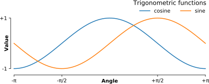

### Ⅱ  图形设计


#### 十个简单的规则

`注意。这一章是我与Michael Droettboom和Philip E. Bourne共同撰写的文章。它于2014年9月在PLOS计算生物学杂志上以共同创作CC0公共领域奉献的形式发表。虽然已经五年过去了，但仍然具有代表性并且非常受欢迎。`

科学可视化经典上被定义为以图形方式显示科学数据的过程。然而，这个过程远非直接或自动化。存在着很多不同的方式来表示相同的数据：散点图、线性图、条形图和饼图等等。而且，使用相同类型的图表来表示相同的数据，根据观察者的不同，可能会有截然不同的感知。对于科学可视化来说，更准确的定义应该是人与数据之间的图形界面。在这篇简短的文章中，我们并不打算解释关于这个界面的一切。相反，我们的目标是提供一套基本规则来改进图表设计，并解释一些常见的陷阱。

##### 规则1：了解你的受众

根据上述定义，当视觉的感知结果与传达者的意图存在显著差异时，问题就会出现。因此，在设计过程的早期阶段，识别受众和视觉传达的信息非常重要。视觉的图形设计应该受到这一意图的指导。如果你只是为自己和直接合作者制作图表，可以跳过设计过程中的一些步骤，因为你们每个人都知道图表的内容。然而，如果你打算在科学期刊上发表图表，你应该确保图表正确无误，并传达了所有相关的信息。对于学生受众，需要特别注意，因为在这种情况下，目标是解释概念。在这种情况下，你可能需要添加额外的信息，以确保概念被完全理解。最后，普通大众可能是最困难的受众，因为你需要设计一个简单、可能是近似的图表，只展示你研究中最重要的部分（图6.1）。这被证明是一个困难的任务。

##### 规则2：明确你的信息

图表的目的是表达一个想法或介绍一些事实或结果，这些内容仅用文字解释会太长（或几乎不可能），无论是在文章中还是在时间有限的口头演示中。在这种情况下，重要的是清楚地确定图表的作用，即潜在信息是什么，图表如何最好地表达这个信息？一旦明确了信息，这个信息将成为设计图表的强有力指南，如图6.2所示。只有在确定了信息后，才值得花时间开发图表，就像在确定了文本的主要观点后才会花时间精心编写文字和句子一样。如果您的图表能够在第一眼传达出惊人的信息，那么您的文章吸引社区的机会就会增加。

##### 规则3：将图形适应于支持媒介

图形可以在各种媒体上展示，比如海报、电脑显示器、投影屏幕（比如口头演示）或者简单的纸张（比如印刷文章）。每种媒体都有其代表性图形的不同物理尺寸，但更重要的是，它们也暗示了不同的观看和互动方式。例如，在口头演示中，图形将只显示一段有限的时间。因此，观众必须迅速理解所展示的内容和代表的意义，同时还要听你的言语解释。在这种情况下，图形必须保持简单，并且信息必须在视觉上引人注目，如图6.3所示。同时，还要记住，在口头演示中，图形将被视频投影，并且会从远处观看，因此图形元素必须加粗（线条）或者放大（点、文字），颜色的选取方面也必须了解你的受众。


图6.1 

这是一张重新制作的图，最初发表在2007年的《纽约时报》（NYT）上。这个新图是使用matplotlib和近似数据制作的。数据由四个系列（男性死亡/病例，女性死亡/病例）组成，可以使用经典的双列（死亡/病例）柱状图来显示。然而，这里使用的布局对于预期的受众来说更好。它利用了新病例数始终大于相应死亡数的事实，将这两个值混合在一起。它还利用了阅读方向（纽约时报的英文从左到右）来方便男性和女性之间的比较，而中央标签则提供了对图的主要信息（癌症）的直接访问。这是一个自包含的图，清晰地传达了关于癌症死亡的明确信息。然而，它并不精确。所选择的布局实际上使得估计肾癌死亡人数变得困难，因为它位于底部位置，并且标记的刻度位于顶部位置。 虽然这对于一般读者的出版物来说是可以接受的，但如果在文章的其他地方没有给出实际数值，那么在科学出版物中是不可接受的。（[rules/rule-1.py](https://github.com/rougier/scientific-visualization-book/blob/master/code/rules/rule-1.py)）

为了有强烈的对比，应避免使用竖排文字等。对于期刊文章来说，情况完全不同，因为读者可以随时查看图表。这意味着需要包含许多细节。


图6.2

确定您的信息。上丘脑（SC）是位于多个功能通路交汇处的脑干结构。几项神经生理学研究表明，SC中活跃神经元的群体编码了诱发快速眼动的视觉目标的位置。从视网膜表面（左侧）到上丘表面（右侧）的投射基于一个标准和定量模型，其中对数映射函数确保了从视网膜坐标到上丘坐标的投射。这种对数映射在快速眼动决策中起着重要作用。为了更好地说明这一作用，使用了人工棋盘格图案，尽管在实验中并不使用这样的图案。这个棋盘格图案清楚地展示了中央凹区域的极端放大，这是图中的主要信息。（rules/rule-2.py）

可以添加，以及在标题中提供补充解释。如果我们考虑到现在越来越多的人在电脑屏幕上阅读文章，他们也有可能进行缩放和拖动图像的操作。理想情况下，每种支持媒介都需要不同的图像，读者应该放弃从文章中提取图像并原样放入口头演示的做法。


图6.3

将图形适应到支持媒介上。

这两个图形代表相同的内容，即对一个双粒子系统轨迹的模拟$$\dot x = (1/4 + (x − y))(1 − x), x ≥ 0, \dot y = (1/4 + (y − x))(1 − y), y ≥ 0)$$，其中每个粒子与另一个粒子相互作用。根据初始条件，系统可能会进入三种不同的状态。左图是为一篇期刊文章准备的，读者可以自由查看每个细节。红色一直用于表示初始条件（缩放面板中的红点）和轨迹（红线）。为了突出轨迹重叠的区域（颜色密度高），线条透明度已增加。右图是为口头报告准备的。由于时间有限，该图的显示不允许观众仔细研究每个细节，因此许多细节已被删除（减少轨迹数量，无重叠轨迹，减少刻度数量，增大坐标轴和刻度标签，无标题，线条更粗）。此外，由于在口头报告中将描述该图，因此已对某些部分进行了修改，以便更容易引用（例如，黄色框，红色虚线）。 （rules/rule‐3.py）

#####  规则4：标题是必须的

无论是描述实验设置、介绍新模型还是呈现新结果，你都不能在图表本身中解释所有内容——图表应该附有标题。标题解释了如何阅读图表，并为无法用图形表示的内容提供了额外的精度。这可以被视为口头演示或海报前的解释，但不同之处在于你必须事先考虑到人们可能会问的问题。例如，如果你有一个条形图，不要期望读者仅凭图上的相对高度来猜测不同条的值。如果数字值很重要，它们则必须在文章的其他地方提供或在图上清晰地写出。同样，如果图中有一个感兴趣的点（关键领域、特定点等），确保它在视觉上与其他元素有所区别，但也不要犹豫在图题中再次指出。

##### 规则5：不要相信默认设置

任何绘图库或软件都带有一组默认设置。当最终用户未指定任何内容时，这些默认设置用于指定大小、字体、颜色、样式、刻度、标记等（图6.4）。几乎可以指定任何设置，并且通常可以通过这些默认设置的选择来识别每个软件包（Matlab、Excel、Keynote等）或库（LaTeX、matplotlib、gnuplot等）的特定样式。由于这些设置可以用于几乎任何类型的图形，因此它们并没有针对特定类型的图形进行精细调整。换句话说，它们对于任何图形都足够好，但对于没有最佳效果。所有的图形都需要至少对不同设置进行一些手动调整，以更好地表达信息，无论是为了使精确的图形对广大观众更加显著，还是为了选择最适合数据性质的最佳颜色映射。例如，有关如何从默认设置转换为更好的可视化效果的内容，请参见第7章中关于matplotlib库的部分。


图6.4 

不要相信默认设置。左侧面板显示了使用默认设置在matplotlib中呈现的正弦和余弦函数。虽然这个图形已经足够清晰，但通过调整各种可用的设置，可以在右侧面板上进行视觉改进。（rules/rule‐5‐left.py和rules/rule‐5‐right.py）


##### 规则6：有效使用颜色效果

颜色是人类视觉中的重要维度，因此在科学图表设计中同样至关重要。然而，正如Edward Tufte所解释的那样，如果不正确使用，颜色可能成为你最好的盟友，也可能成为你最大的敌人。如果你决定使用颜色，你应该考虑使用哪些颜色以及在哪里使用它们。例如，为了突出图表中的某个元素，你可以使用颜色来表示该元素，同时将其他元素保持为灰色或黑色。这会产生增强效果。然而，如果你没有这样的需求，你需要问自己：“为什么这个图表是蓝色而不是黑色？”如果你不知道答案，保持它为黑色。对于颜色映射也是如此。除非有明确的原因（参见图6.5），否则不要使用默认的颜色映射（例如jet或rainbow）。颜色映射通常分为三个主要类别：

- 顺序：一种独特颜色的变化，用于表示从低到高的定量数据。
- 分歧：从一种颜色变化到另一种颜色，用于突出与中值的偏差。
- 定性：颜色的快速变化，主要用于离散或分类数据。

使用与您的数据最相关的颜色映射。最后，避免使用过多相似的颜色，因为色盲可能会使一些颜色差异难以辨别。


图6.5

**有效地使用颜色**。该图表示相同信号，其频率向右增加，强度向底部增加，使用三种不同的颜色映射。彩虹色彩映射（定性）和地震色彩映射（发散）对于这样的信号同样不好，因为它们倾向于隐藏高频域（右下部分）的细节。使用顺序色彩映射，如紫色，更容易看到高频域中的细节。（rules/rule-6.py）

图书馆或软件所做的明确选择旨在在大多数情况下准确，但在某些情况下可能会误导观众。如果您的软件自动重新调整值，您可能会获得数据的客观表示（因为标题、标签和刻度清楚地指示了实际显示的内容），但在视觉上却具有误导性（请参见图6.6中的条形图）；您无意中让读者在视觉上相信了数据中不存在的东西。您还可以通过设计选择错误的明确选择，例如使用饼图或3D图表来比较数量。这两种类型的图表已知会引发对数量的错误感知，使用它们需要一些专业知识。作为一个经验法则，确保始终使用能够传达您的信息的最简单类型的图表，并确保在相关情况下使用标签、刻度、标题和完整的值范围。最后，不要犹豫向同事询问他们对您图表的解读。


##### 规则7：不要误导读者

区分科学图形与其他图形艺术的是需要尽可能客观展示的数据的存在。科学图形根据定义与数据相关联（无论是实验设置、模型还是一些结果），如果放松这种关联，可能会无意中传达出与预期不同的信息。然而，客观地呈现结果并不总是直接明了的。例如，有一些不确定性的数据可能需要以某种方式进行处理，以便更好地传达信息。


图6.6

**不要误导读者。**在图的左侧部分，我们表示了一系列四个数值：30、20、15、10。在左上部分，我们使用圆盘面积来表示数值，而在底部部分，我们使用圆盘半径。结果在视觉上有很大的差异。在后一种情况下（红色圆圈），最后一个数值（10）与第一个数值（30）相比显得非常小，而两个数值之间的比例只有31。这种情况在文献中实际上非常常见，因为用于生成圆圈或散点图（点大小可变）的命令（或界面）默认使用半径来指定圆盘大小。因此，使用半径作为数值似乎是合乎逻辑的，但这是误导性的。在图的右侧部分，我们使用顶部部分的完整数值范围（y轴从0到100）或底部部分的部分数值范围（y轴从80到100）显示了一系列十个数值，并且明确没有标记y轴以增加混淆。这两个系列的视觉感知完全不同。 在顶部（黑色系列）中，我们倾向于将这些值解释为非常相似，而在底部，我们倾向于认为存在显著差异。即使我们使用标签来指示实际范围，这种效果仍然会存在，因为这些图表中的条形是最显著的信息。（rules/rule-7.py )


##### 规则8：避免“图表垃圾”

图表杂乱指的是图表中的所有不必要或令人困惑的视觉元素，它们并不能改善信息传达（在最好的情况下）或增加理解成本。

在最糟糕的情况下，图表杂乱可能包括使用过多的颜色、过多的标签、过度使用彩色背景、无用的网格线等（见图6.7左侧）。这个术语最早由爱德华·图夫提出，他认为任何不传达新信息的装饰都应该被禁止：“不管原因是什么，这都是非数据墨水或多余的数据墨水，通常是图表杂乱。”因此，为了避免图表杂乱，在计算时代，尽量节省墨水或电子。斯蒂芬·菲尔提醒我们，图表理想情况下应该“呈现出所有需要看到和理解有意义的数据。”然而，在一个图表中被认为是图表杂乱的元素，在另一个图表中可能是合理的。例如，在常规图中使用背景颜色通常是一个不好的主意，因为它并没有提供有用的信息。然而，在图7的右侧部分，我们使用灰色背景框来表示范围[-1，+1]，如标题所述。如果你有疑问，不要犹豫，请去查阅Kaiser Fung的优秀博客，通过对许多例子的研究，他很清楚地解释了图表垃圾的概念。


图6.7 避免图表杂乱无章

我们有七个同等重要的样本系列，希望将它们全部展示出来以进行视觉比较（确切的信号数值应在其他地方给出）。左图展示了可能是最糟糕的设计之一。所有曲线相互覆盖，而且软件自动选择的不同颜色并没有帮助我们区分它们。图例框重叠在图形的一部分上，使得无法检查该区域是否有任何有趣的信息。刻度线太多：x轴标签相互重叠，导致无法阅读，而三位数的精度似乎没有传达任何重要信息。最后，网格没有起到帮助作用，因为（除了其他批评之外）它与信号不对齐，考虑到样本点的数量很少，可以认为信号是离散的。右图采用了完全不同的布局，同时在纸张上使用了相同的区域。系列被分成了七个图，每个图显示一个系列，而其他系列则以非常浅的颜色绘制在主要系列的后面。 每个图的左侧都标有系列标签，避免使用颜色和图例框。x轴刻度的数量已经减少到三个，并且通过一条细线在所有图中表示这三个值。最后，y轴刻度已经完全移除，灰色背景框的高度表示[-1，+1]范围（如果该图将用于文章中，这也应在图题中指明）。（[rules/rule-8.py](https://github.com/rougier/scientific-visualization-book/blob/master/code/rules/rule-8.py) )

##### 规则9：信息胜过丽

自古以来，科学文献中一直使用图表。多年来取得了很大进展，每个科学领域都发展出了自己的最佳实践。了解这些标准非常重要，因为它们可以促进模型、研究或实验之间更直接的比较。更重要的是，它们可以帮助您发现结果中的明显错误。然而，大多数情况下，您可能需要设计一个全新的图表，因为没有标准的描述研究的方式。在这种情况下，浏览科学文献是一个很好的起点。如果某篇文章展示了一个令人惊叹的图表来介绍与您类似的结果，您可能想尝试将该图表适应到自己的需求上（请注意，我们并没有说要复制；要小心图像版权）。如果您转发到网络上，必须非常小心，因为数据可视化、信息图表、设计和艺术之间的界限变得越来越模糊。网络上存在着无数以美学为第一标准、内容较次的图形。 即使很多图形可能被认为很美，但大部分并不符合科学框架。请记住，在科学中，图形的信息传递和可读性是最重要的方面，而美观只是一个选择，正如图6.8所生动展示的那样。


图6.8 信息胜过美丽。这个图形是一个极端情况，即使图形的美学值得质疑，信息仍然特别清晰。恐怖谷效应是机器人领域中一个众所周知的假设，它与机器人的人类相似度相关联。为了表达这种假设性质，使用了假设数据$$(y=x^2 - 5e^{-5(x-2)^2})$$，并给图形添加了素描效果（在matplotlib上使用xkcd滤镜），配合卡通字体，增强整体效果。刻度标签也被移除，因为只有曲线的整体形状才重要。使用素描风格向观众传达数据的近似性，以及重要的是高层次概念而不是低层次细节。（[rules/rule-9.py](https://github.com/rougier/scientific-visualization-book/blob/master/code/rules/rule-9.py)）

##### 规则10：选择合适的工具

有许多工具可以在创建图形时让你的生活变得更轻松，了解其中一些工具可以节省很多时间。根据你想要创建的可视化类型，通常会有专门的工具可以实现你的目标。在这一点上，重要的是要明白，用于制作可视化的软件或库可能与用于进行研究和/或分析数据的软件或库不同。你总是可以导出数据以便在另一个工具中使用它。无论是绘制图表、设计实验方案还是绘制数据，都有适合你的开源工具。它们只是在等待被发现和使用。以下是一小部分开源工具的列表。

- Matplotlib是一个Python绘图库，主要用于二维绘图，但也可以具有一些3D支持，可以在各种硬拷贝格式和交互环境中生成出版质量的图形，适用于各个平台。它还附带了一个庞大的示例库，几乎涵盖了所有科学领域。

- R是一种用于统计计算和图形的语言和环境。R提供了各种各样的统计（线性和非线性建模，经典统计检验，时间序列分析，分类，聚类等）和图形技术，并且具有高度可扩展性。

- Inkscape是一款专业的矢量图形编辑器。它允许您设计复杂的图形，并且可以用于改进脚本生成的图形，或者从PDF文件中提取图形并按照您的喜好进行转换。

- TikZ和PGF是用于以编程方式创建图形的TeX软件包。TikZ建立在PGF之上，可以以相当直观和简单的方式创建复杂的图形，正如Tikz图库所展示的那样。

- GIMP是GNU图像处理程序。它是一个用于照片修饰、图像合成和图像创作等任务的应用程序。如果您需要快速修饰图像或添加一些图例或标签，GIMP是完美的工具。

- ImageMagick是一个软件套件，用于通过命令行创建、编辑、合成或转换位图图像。它可以用于快速将图像转换为另一种格式，并且Fred Weinhaus的庞大脚本库几乎可以提供您想要实现的任何效果。

- D3.js（或简称为D3）是一个JavaScript库，提供了一种简单的方式来创建和控制在Web浏览器中运行的基于数据的交互式图形形式，如图库所示。

- Cytoscape是一个用于可视化复杂网络并与任何类型的属性数据集成的软件平台。如果您的数据或结果非常复杂，Cytoscape可能会帮助您减轻这种复杂性。

- Circos最初是为了可视化基因组数据而设计的，但可以从任何领域的数据创建图表。如果您有描述关系或多层注释的数据，Circos非常有用。

  

#### 掌握默认设置

我们刚刚解释过（参见第6章的规则5），任何可视化库或软件都带有一组默认设置来识别它。例如，图7.1展示了Google计算器、Julia、Gnuplot和Matlab渲染的正弦和余弦函数。即使对于这样简单的函数，这些显示也具有相当的特征。


图7.1 

正弦和余弦函数的显示，分别为（A）Google计算器，（B）Julia，（C）Gnu-plot，（D）Matlab。


让我们使用Matplotlib的默认设置绘制正弦和余弦函数。

```python
mport numpy as np
import matplotlib.pyplot as plt
X = np.linspace(-np.pi, np.pi, 256, endpoint=True)
C, S = np.cos(X), np.sin(X)
plt.plot(X, C)
plt.plot(X, S)
plt.show()
```

图7.3展示了一个非常典型的Matplotlib结果。


图7.2 隐式默认的正弦和余弦函数（源文件 [defaults/defaults‐step‐1.py](https://github.com/rougier/scientific-visualization-book/blob/master/code/defaults/defaults-step-1.py)）


##### 明确的设置

让我们现在重新绘制图表，但要包括所有不同设置的规格。这包括图表大小、线条颜色、宽度和样式，以及刻度位置和标签，轴限制等。

```python
fig = plt.figure(figsize = p['figure.figsize'],
			   	dpi = p['figure.dpi'],
				facecolor = p['figure.facecolor'],
				edgecolor = p['figure.edgecolor'],
				frameon = p['figure.frameon'])
ax = plt.subplot(1,1,1)
ax.plot(X, C, color="C0",
				linewidth = p['lines.linewidth'],
				linestyle = p['lines.linestyle'])
ax.plot(X, S, color="C1",
				linewidth = p['lines.linewidth'],
				linestyle = p['lines.linestyle'])
xmin, xmax = X.min(), X.max()
xmargin = p['axes.xmargin']*(xmax - xmin)
ax.set_xlim(xmin - xmargin, xmax + xmargin)
ymin, ymax = min(C.min(), S.min()), max(C.max(), S.max())
ymargin = p['axes.ymargin']*(ymax - ymin)
ax.set_ylim(ymin - ymargin, ymax + ymargin)
ax.tick_params(axis = "x", which="major",
				direction = p['xtick.direction'],
				length = p['xtick.major.size'],
				width = p['xtick.major.width'])
ax.tick_params(axis = "y", which="major",
				direction = p['ytick.direction'],
				length = p['ytick.major.size'],
				width = p['ytick.major.width'])
plt.show()
```

生成的图形7.3是7.2的精确副本。这并不令人惊讶，因为我注意到了Matplotlib隐式使用的默认值，并将它们显式地设置了。实际上，在这个简短的示例中，还有许多默认选择我没有展示出来。例如，刻度标签的字体系列、倾斜度、粗细和大小可以在默认设置中进行配置。


#### 用户设置

请注意，我们也可以做相反的操作，在创建图形之前更改默认设置。这样，matplotlib将使用我们自定义的默认设置而不是标准设置。


图7.3

使用matplotlib明确的默认值绘制正弦和余弦函数（源代码 [defaults/defaults‐step‐2.py](https://github.com/rougier/scientific-visualization-book/blob/master/code/defaults/defaults-step-2.py)）

结果显示在图7.4中，我改变了一些设置。不幸的是，并非所有的设置都可以通过这种方式修改。例如，标记的位置（markevery）目前还无法自定义设置。

```python
p["figure.figsize"] = 6,2.5
p["figure.edgecolor"] = "black"
p["figure.facecolor"] = "#f9f9f9"
p["axes.linewidth"] = 1
p["axes.facecolor"] = "#f9f9f9"
p["axes.ymargin"] = 0.1
p["axes.spines.bottom"] = True
p["axes.spines.left"] = True
p["axes.spines.right"] = False
p["axes.spines.top"] = False
p["font.sans-serif"] = ["Fira Sans Condensed"]
p["axes.grid"] = False
p["grid.color"] = "black"
p["grid.linewidth"] = .1
p["xtick.bottom"] = True
p["xtick.top"] = False
p["xtick.direction"] = "out"
p["xtick.major.size"] = 5
p["xtick.major.width"] = 1
p["xtick.minor.size"] = 3
p["xtick.minor.width"] = .5
p["xtick.minor.visible"] = True
p["ytick.left"] = True
p["ytick.right"] = False
p["ytick.direction"] = "out"
p["ytick.major.size"] = 5
p["ytick.major.width"] = 1
p["ytick.minor.size"] = 3
p["ytick.minor.width"] = .5
p["ytick.minor.visible"] = True
p["lines.linewidth"] = 2
p["lines.markersize"] = 5
fig = plt.figure(linewidth=1)
ax = plt.subplot(1,1,1,aspect=1)
ax.plot(X, C)
ax.plot(X, S)
plt.show()
```


#### 样式表

修改默认设置是自定义图形样式的一种简单方法。但是，像我们之前所做的那样在图形脚本中编写这样的样式并不是很方便，这就是样式发挥作用的地方。样式是描述（某些）设置的小型文本文件，其定义方式与主资源文件[matplotlibrc](https://matplotlib.org/stable/tutorials/introductory/customizing.html#the-matplotlibrc-file)中的定义方式相同。

```python
figure.figsize: 6,2.5
figure.edgecolor: black
figure.facecolor: ffffff
```


图7.4

使用自定义默认值的正弦和余弦函数（源文件 [defaults/defaults‐step‐3.py](https://github.com/rougier/scientific-visualization-book/blob/master/code/defaults/defaults-step-3.py)）

```python
axes.linewidth: 1
axes.facecolor: ffffff
axes.ymargin: 0.1
axes.spines.bottom: True
axes.spines.left: True
axes.spines.right: False
axes.spines.top: False
font.sans-serif: Fira Sans Condensed
axes.grid: False
grid.color: black
grid.linewidth: .1
xtick.bottom: True
xtick.top: False
xtick.direction: out
xtick.major.size: 5
xtick.major.width: 1
xtick.minor.size: 3
xtick.minor.width: .5
xtick.minor.visible: True
ytick.left: True
ytick.right: False
ytick.direction: out
ytick.major.size: 5
ytick.major.width: 1
ytick.minor.size: 3
ytick.minor.width: .5
ytick.minor.visible: True
lines.linewidth: 2
lines.markersize: 5
```

现在我们可以写：

```python
plt.style.use("./mystyle.txt")
fig = plt.figure(linewidth=1)
ax = plt.subplot(1,1,1,aspect=1)
ax.plot(X, C)
ax.plot(X, S)
ax.set_yticks([-1,0,1])
```

####  超越样式表

如果样式表允许设置相当数量的参数，即使我们不能使用样式表来改变它们，仍然有很多其他可以改变以改善图形样式的事情。其中一个原因是这些设置是特定于给定的图形，将它们设置在样式表中是没有意义的。在正弦和余弦的情况下，我们可以明确指定xticks的位置和标签，利用我们知道我们正在处理三角函数的事实。

```python
ax.set_yticks([-1,1])
ax.set_xticklabels(["-1", "+1"])
ax.set_xticks([-np.pi, -np.pi/2, np.pi/2, np.pi])
ax.set_xticklabels(["π-", "π-/2", "π+/2", "π+"])
```

我们还可以移动坐标轴，使其居中：

```python
ax.spines['bottom'].set_position(('data',0))
ax.spines['left'].set_position(('data',0))
```

在坐标轴的两端添加一些箭头：

```python
ax.plot(1, 0, ">k",transform=ax.get_yaxis_transform(), clip_on=False)
ax.plot(0, 1, "^k",transform=ax.get_xaxis_transform(), clip_on=False)
```

您可以在图7.5中看到结果。从这个结果开始，您可以开始优化。可以进一步完善这个数字。但是记住，如果稍微调整参数是可以的，但你也可能会浪费很多时间（相信我）（译者注：因为参数处于无穷大的搜索空间中）。


图7.5

使用自定义默认值和微调的正弦和余弦函数。（源文件 [defaults/defaults‐step‐5.py](https://github.com/rougier/scientific-visualization-book/blob/master/code/defaults/defaults-step-5.py)）


#### 练习

从下面的代码开始，尝试通过仅修改rc设置来复现图[7.6](https://app.immersivetranslate.com/pdf/#figure.caption.69)。

```python
fig = plt.figure()
ax = plt.subplot(1,1,1,aspect=1)
ax.plot(X, C, markevery=(0, 64), clip_on=False, zorder=10)
ax.plot(X, S, markevery=(0, 64), clip_on=False, zorder=10)
ax.set_yticks([-1,0,1])
ax.set_xticks([-np.pi, -np.pi/2, 0, np.pi/2, np.pi])
ax.set_xticklabels(["π-", "π-/2", "0", "π+/2", "π+"])
ax.spines['bottom'].set_position(('data',0))
```


图7.6

正弦和余弦的替代表示（解决方案 [defaults/defaults‐exercice‐1.py](https://github.com/rougier/scientific-visualization-book/blob/master/code/defaults/defaults-exercice-1.py) ）


### 大小、比例和布局 

图形和子图的布局无疑是Matplotlib中最令人沮丧的方面之一，对于新用户来说，要获得所需的布局通常需要进行大量的尝试和错误。但这并不仅限于Matplotlib，实际上对于任何软件来说都同样困难（对于某些软件来说甚至更糟）。要理解为什么这么困难，就需要更好地了解底层机制。


#### 图形和坐标轴的方面

当创建一个新的图形时，其具有特定的大小，可以通过默认值（如前一章节所述）或通过figsize关键字来显式指定。如果将图形的高度除以宽度，就得到了图形的纵横比。当创建一个坐标轴时，还可以指定一个由matplotlib强制运行的纵横比。在这里，我们遇到了第一个困难。对于具有特定纵横比的容器，如果想要在其中放置一个具有不同纵横比的项目，matplotlib就必须解决这些约束。这在图8.1中用不同的情况进行了说明。

A: 图形比例为1，坐标轴比例为1，x和y的范围相等

```python
fig = plt.figure(figsize=(6,6))
ax = plt.subplot(1,1,1, aspect=1)
ax.set_xlim(0,1), ax.set_ylim(0,1)
```

B: 图形纵横比为1/2，坐标轴纵横比为1，x和y的范围相等

```python
fig = plt.figure(figsize=(6,3))
ax = plt.subplot(1,1,1, aspect=1)
ax.set_xlim(0,1), ax.set_ylim(0,1)
```

C：图形纵横比为1/2，坐标轴纵横比为1，x和y的范围不同

```python
fig = plt.figure(figsize=(6,3))
ax = plt.subplot(1,1,1, aspect=1)
ax.set_xlim(0,2), ax.set_ylim(0,1)
```

D: 图形的长宽比为2，坐标轴的长宽比为1，x和y的取值范围相等

```python
fig = plt.figure(figsize=(3,6))
ax = plt.subplot(1,1,1, aspect=1)
ax.set_xlim(0,1), ax.set_ylim(0,1)
```

E: 图形纵横比为1，坐标轴纵横比为1，x和y的范围不同

```python
fig = plt.figure(figsize=(6,6))
ax = plt.subplot(1,1,1, aspect=1)
ax.set_xlim(0,2), ax.set_ylim(0,1)
```

F: 图形纵横比为1，坐标轴纵横比为0.5，x和y的范围相等

```python
fig = plt.figure(figsize=(6,6))
ax = plt.subplot(1,1,1, aspect='auto')
ax.set_xlim(0,1), ax.set_ylim(0,1)
```

G：图形的纵横比为1/2，坐标轴的纵横比为1，x和y的范围不同

```python
fig = plt.figure(figsize=(3,6))
ax = plt.subplot(1,1,1, aspect=1)
ax.set_xlim(0,1), ax.set_ylim(0,2)
```

H：图形的纵横比为1，坐标轴的纵横比也为1，x和y的范围不同

```python
fig = plt.figure(figsize=(6,6))
ax = plt.subplot(1,1,1, aspect='auto')
ax.set_xlim(0,1), ax.set_ylim(0,2)
```

I：图形的长宽比为1，坐标轴的长宽比为2，x和y的取值范围相等

```python
fig = plt.figure(figsize=(6,6))
ax = plt.subplot(1,1,1, aspect='auto')
ax.set_xlim(0,1), ax.set_ylim(0,1)
```


图8.1

图形和坐标轴的纵横比的组合


图形的最终布局是由一组约束条件决定的，这使得预测最终结果变得困难。当将几个轴线组合在同一图形上时，这种情况变得更加严重，就像图8.2、8.3和8.4所示。根据图形中重要的因素（比例、范围或大小），会优先考虑其中之一的布局。无论如何，你现在应该已经意识到如果过度约束布局，会导致后果无法预料的问题，而matplotlib会尽力寻找最佳的折中方案。


#### 轴布局

既然知道了图形和坐标轴的方面如何相互作用，现在是时候将图形组织成子图样式了。在前一节中，我们已经看到了一个例子，但现在让我们深入其中来看看细节。在matplotlib中确实存在有几种不同的方法可以创建子图，每种方法都有其优缺点。让我们以一个非常简单的例子为例，我们想要将两个坐标轴并排放置。为了实现这个目标，我们可以使用 add_subplot、add_axes、GridSpec 和 subplot_mosaic 方法。


图8.2

相同尺寸，相同刻度，不同外观（来源 [layout/layout‐aspect.py](https://github.com/rougier/scientific-visualization-book/blob/master/code/layout/layout-aspect.py)）

```python
fig = plt.figure(figsize=(6,2))
# Using subplots
```


图8.3

相同的刻度，相同的方面，不同的大小（来源  layout/layout‐aspect.py）

```python
ax1 = fig.add_subplot(1,2,1)
ax2 = fig.add_subplot(1,2,2)
# Using gridspecs
G = GridSpec(1,2)
ax1 = fig.add_subplot(G[0,0])
ax2 = fig.add_subplot(G[0,1])
# Using axes
```


图8.4

相同尺寸，相同比例，不同刻度（源布局/layout‐aspect.py）


```python
ax1 = fig.add_axes([0.1, 0.1, 0.35, 0.8])
ax2 = fig.add_axes([0.6, 0.1, 0.35, 0.8])
# Using mosaic
ax1, ax2 = fig.add_mosaic("AB")
```


作为一般建议，鼓励用户使用gridspec方法，因为它相比传统方式提供了更多的灵活性。例如，图8.5展示了一个漂亮而简单的3x3布局，但对于每个轴的相对方面没有太多控制，而在图8.6中，我们可以非常容易地指定每个轴的不同大小。


图8.5

使用经典布局的子图。（源代码[layout/layout‐classical.py](https://github.com/rougier/scientific-visualization-book/blob/master/code/layout/layout-classical.py)）


网格规范的最大困难在于正确设置坐标轴，即在正确的位置上以正确的大小显示，这取决于网格规范的初始分区，考虑到不同的高度和宽度比例。让我们以图8.7为例，展示了一个相对复杂的布局。问题是：我们应该如何进行分区？我们是否需要一个单独的坐标轴来。


图8.6  

使用gridspec布局的子图（源地址[layout/layout-gridspec.py]( https://github.com/rougier/scientific-visualization-book/blob/master/code/layout/layout-gridspec.py)）

小图像的独立轴？左侧的文本是否属于轴的一部分，还是它们使用自己的轴。有几种解决方案，图8.8展示了选择设计这个图的解决方案。子图和左侧标签都有各自的轴。还有一个小的轴线用于标题，以确保子图的大小都相同。如果在第一行子图上使用了一个标题，这将会改变它们与其他子图的相对大小。顶部的图例使用了两个轴，一个用于颜色图例的轴，另一个用于解释详情。在这种情况下，使用中心轴，并将文本写在轴的外部，指定其不需要被裁剪。


图8.7

复杂布局（源[layout/complex‐layout.py](https://github.com/rougier/scientific-visualization-book/blob/master/code/layout/complex-layout.py)）


**练习**

标准布局1 使用gridspec，目标是复现图8.9，其中色条与主轴大小相同，其宽度为主轴宽度的十分之一。


图8.8

复杂的布局结构（源地址[layout/complex‐layout‐bare.py](https://github.com/rougier/scientific-visualization-book/blob/master/code/layout/complex-layout-bare.py)）


标准布局2  使用gridspec，目标是通过将顶部和右侧的直方图与主轴对齐来复现图8.10。


图8.9 图像和色条（来源 [layout/standard‐layout‐1.py](https://github.com/rougier/scientific-visualization-book/blob/master/code/layout/complex-layout-bare.py) )）


图8.10散点图和直方图（来源 [layout/standard‐layout‐2.py](layout/standard‐layout‐2.py)）


### 装饰物

装饰物指的是你可以添加到图形中以美化或使其更清晰的所有额外元素。装饰物包括标准元素，如图例、注释、色条和文本，但你也可以为你的图形设计自己的元素。例如，图9.1展示了标准元素（注释和文本）以及特定元素（使用竖线标记在x轴上报告的根）。


图9.1 贝塞尔函数（来源：[ornaments/bessel‐functions.py](https://github.com/rougier/scientific-visualization-book/blob/master/code/layout/standard-layout-2.py)）。

可以在图形中添加无数的装饰品，但是要注意必须保证图形的可读性，不要过于复杂。

#### 图例


图例非常容易使用，只需要用户为图表命名即可。Matplotlib会自动处理图例的放置（这是非常棘手的，因此可能会失败），并显示必要的信息（见图9.2）。图例提供了几个选项，可以控制图例的各个方面，在大多数情况下，只需简单地调用legend()函数即可满足需求，如下所示：

```python
fig = plt.figure(figsize=(6,2.5))
ax = plt.subplot()
X = np.linspace(-np.pi, np.pi, 256, endpoint=True)
ax.plot(X, np.cos(X), label="cosine")
ax.plot(X, np.sin(X), label="sine")
ax.legend()
plt.show()
```


图9.2

常规图例（来源：[ornaments/legend‐regular.py](https://github.com/rougier/scientific-visualization-book/blob/master/code/ornaments/bessel-functions.py) ）。

然而，在某些情况下，图例可能不是添加信息的最合适方式。例如，当有多个图时，读者来回切换图和图例可能会变得乏味。另一种选择是直接在图上添加信息，如图9.3所示。这个图示介绍了四种不同的方法，可以直接给图表加标签。


图9.3替代说明（来源：ornaments/[legend‐alternatives.py](https://github.com/rougier/scientific-visualization-book/blob/master/code/ornaments/legend-alternatives.py)）。

没有最好的替代方案，因为它适数据而定。对于显示的正弦/余弦示例（相当简单的情况），这四个解决方案都很合适，但是当与真实数据一起使用时，可能没有一个替代方案适合数据。在这种情况下，就需要一种替代的数据标记方式，或者您可能需要将图形分成几个图。


#### 标题和标签

我们已经使用set_title、set_xlabel和set_ylabel方法来操作标题和标签。当没有任何额外参数时，它们通常能够很好地完成工作，并且它们的位置通常对于大多数图形来说都很好。尽管如此，也可以通过调整各种参数来美化图形，如图9.4所示。在这个例子中，只是将标签移动到更靠近轴的位置，并且注意到要删除中央刻度，否则它会与标签相撞。对于标题，将它向右移动，并相应地移动图例框（使用两列），即在标题下方。上述操作没有什么复杂的东西，但我认为结果在视觉上更加愉悦。




图9.4

常规标题（来源: [ornaments/title‐regular.py](https://github.com/rougier/scientific-visualization-book/blob/master/code/ornaments/title-regular.py)）。

在某些情况下（例如会议海报），就可能需要使标题更加引人注目，如图9.5所示。这可以通过使用make_axes_locatable方法划分每个轴并为实际标题保留15％的高度来实现。在这个图中，我还使用LaTeX插入了一个完全对齐的文本，可以被视为另一种形式或（高级）装饰。


图9.5高级文本框（来源: [ornaments/latex‐text‐box.py](https://github.com/rougier/scientific-visualization-book/blob/master/code/ornaments/latex-text-box.py) ）。


#### 注释

注释可能是 matplotlib 中最难处理的对象。原因是它涉及许多不同的概念，导致潜在的参数数量很高。此外，还存在一个补充难度，因为注释涉及文本，其大小用点表示。最终，可能需要混合以像素、点、分数或数据单位表示的绝对或相对坐标。如果添加了可以注释任何具有任何投影类型的轴，您现在可能会意识到为什么 annotate 方法提供了如此多的参数。注释图表最简单的方法是在要注释的点附近添加标签，如图9.6所示。在这个图表中，我特意给标签添加了白色轮廓，以确保无论数据分布如何，它们都能保持可读性。然而，如果点过多，所有不同的标签可能会让图表混乱，并且可能隐藏了重要信息。


图9.6

直接注释  （来源: [ornaments/annotation‐direct.py](https://github.com/rougier/scientific-visualization-book/blob/master/code/ornaments/annotation-direct.py) ).


另一种方式是将标签推到图形的侧边，并使用虚线来建立点与标签之间的连接，正如图9.7所示。但这一过程远非自动化，为了设计该图形，不得不计算几乎所有内容。首先，为了使线条不相交，要对想标记的点进行排序：


```python
X = np.random.normal(0, .35, 1000)
Y = np.random.normal(0, .35, 1000)
ax.scatter(X, Y, edgecolor="None", facecolor="C1", alpha=0.5)
I = np.random.choice(len(X), size=5, replace=False)
Px, Py = X[I], Y[I]
I = np.argsort(Y[I])[::-1]
Px, Py = Px[I], Py[I]
```

从上述这些要点出发，已经能够使用一种相当复杂的连接方式进行注释：


```python
y, dy = .25, 0.125
style = "arc,angleA=-0,angleB=0,armA=-100,armB=0,rad=0"
for i in range(len(I)):
	ax.annotate("Point " + chr(ord("A")+i),
				xy = (Px[i], Py[i]), xycoords='data',
				xytext = (1.25, y-i*dy), textcoords='data',
				arrowprops=dict(arrowstyle="->", color="black",
								linewidth=.75,
								shrinkA=20, shrinkB=5,
								patchA=None, patchB=None,
								connectionstyle=style))
```


图9.7

侧边注释 （来源: [ornaments/annotation‐side.py](https://github.com/rougier/scientific-visualization-book/blob/master/code/ornaments/annotation-side.py) ）


图9.8展示了使用连接图案注释轴外对象的可能性。在这个示例中，我创建了几个矩形，显示了一些点周围的感兴趣区域，并创建了与相应的缩放轴的连接。请注意连接是从矩形的外部开始的，这是注释提供的一个很好的特性之一：可以指定要注释的对象的性质（通过提供一个补丁），matplotlib会确保连接的起点位于补丁的边界上。


图9.8

缩放注释（来源：[ornaments/annotation-zoom.py](https://github.com/rougier/scientific-visualization-book/blob/master/code/ornaments/annotation-zoom.py)）。

#### 练习

现在轮到你来尝试使用装饰品来复现图9.9，该图显示了几个装饰品，包括左侧和底部的自定义装饰品。这个装饰品可以快速显示出重量和高度的分布情况，并可以使用大型垂直和水平标记的散点图来呈现。

​														按性别和年龄分布身高和体重（虚假数据）


图9.9

优雅的散点图（来源：[ornaments/elegant‐scatter.py](https://github.com/rougier/scientific-visualization-book/blob/master/code/ornaments/elegant-scatter.py) ）


